# Antigravity Skills Master Suite (`03_Skills` / `skills/`)

Welcome to the **03_Skills** directory of your Personal Knowledge Management (PKM) and AI Engineering Vault. This directory bridges the local Obsidian Knowledge OS with our Antigravity / AI assistant skill library located in `/skills/`. 

While **04_Knowledge** stores passive domain knowledge (concepts, research papers, architectures), **03_Skills** stores active, procedural instructions—the standard operating procedures (SOPs), execution workflows, and step-by-step checklists that teach AI agents and developers *how to execute* complex tasks.

---

## 🏛️ Master Skills Catalog & Sitemap

```mermaid
graph TD
    Suite[03_Skills Master Suite]
    
    Suite --> S1[1. Multi-Platform Web Search & OSINT]
    Suite --> S2[2. Self-Hosted AI Infrastructure & PaaS]
    Suite --> S3[3. Autonomous Agent & Web Automation]
    Suite --> S4[4. Viral Solopreneur Launchpad]
    Suite --> S5[5. Next-Gen SEO & Instant Indexing]
    Suite --> S6[6. Defensive Security & Threat OSINT]
    Suite --> S7[7. Obsidian Vault Formatting & PKM]
    
    click S1 "file:///H:/portfolio_website/hemalshah/03_Skills/multi_platform_web_search/SKILL.md"
    click S2 "file:///H:/portfolio_website/hemalshah/03_Skills/self_hosted_ai_infrastructure/SKILL.md"
    click S3 "file:///H:/portfolio_website/hemalshah/03_Skills/autonomous_agent_and_web_automation/SKILL.md"
    click S4 "file:///H:/portfolio_website/hemalshah/03_Skills/viral_solopreneur_launchpad/SKILL.md"
    click S5 "file:///H:/portfolio_website/hemalshah/03_Skills/nextgen_seo_and_instant_indexing/SKILL.md"
    click S6 "file:///H:/portfolio_website/hemalshah/03_Skills/defensive_security_and_threat_osint/SKILL.md"
    click S7 "file:///H:/portfolio_website/hemalshah/03_Skills/obsidian_vault_formatting/SKILL.md"
```

---

## 📑 Active Skill Registry (Obsidian Integration)

- `[[ai_knowledge_os_skill/SKILL]]` — Master skill governing the Obsidian Markdown-first Knowledge Operating System.
- `[[architecture-and-design-skill/SKILL]]` — System design blueprints, boilerplate code, and naming conventions.
- `[[atozgadgetz_redesign/SKILL]]` — Standard operating procedure for e-commerce redesigns and WooCommerce migrations.
- `[[code-review-and-quality-skill/SKILL]]` — CTO-level code review checklists, style guides, and linting rules.
- `[[debugging-api-data-extraction/SKILL]]` — Workflows for diagnosing API latency, data extraction failures, and JSON schemas.
- `[[e2e-universal-testing/SKILL]]` — Universal end-to-end testing protocols across frontend and backend services.
- `[[geo_optimization_skill/SKILL]]` — Generative Engine Optimization (GEO) strategies for AI search visibility.
- `[[google-seo-docs/SKILL]]` — Official Google Search documentation and SEO ranking factor rules.
- `[[hostinger-production/SKILL]]` — Production deployment checklists and rollbacks for Node.js and Next.js applications.
- `[[keyword-cluster-generator/SKILL]]` — Programmatic topic clustering and internal linking automation.
- `[[master-seo-toolkit/SKILL]]` — End-to-end SEO audit scripts, technical schema validators, and canonical injectors.
- `[[memory-mcp-skill/SKILL]]` — Model Context Protocol (MCP) memory management and retrieval protocols.
- `[[pgeo-optimization-skill/SKILL]]` — Programmatic GEO and AI answer engine saturation workflows.
- `[[production-web-engineer/SKILL]]` — Core Web Vitals (100/100) engineering, CSS optimization, and JavaScript refactoring.
- `[[secure-testing-workflow/SKILL]]` — Safe security auditing, XSS vulnerability testing, and CSP header verification.
- `[[subagent-delegation-skill/SKILL]]` — Protocols for spawning, delegating to, and managing autonomous AI subagents.

---

## 🚀 How to Invoke & Utilize These Skills
When executing a project or task, refer to the corresponding skill's `SKILL.md` file to follow its standardized procedural checklists, code snippets, and architectural diagrams. Each skill is designed to translate the deep theoretical knowledge from **04_Knowledge** into immediate, error-free execution!
