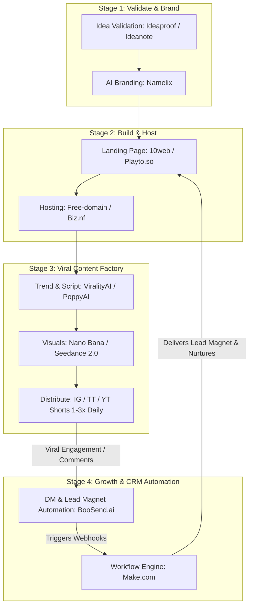

# The Zero-Cost AI Solopreneur & Viral Organic Micro-SaaS Launchpad Playbook

This document decodes the exact startup growth stack you uncovered—analyzing what each tool does, mapping how indie hackers and founders on LinkedIn leverage this ecosystem for organic viral growth (posting 1–3x per day on IG/TT/YT), and providing a **100% Free, Open-Source, and Self-Hosted Alternative Execution Plan** for every single stage.

---

## 1. Decoding the Playbook: What is "All This"?

You have identified the **Modern AI Solopreneur Zero-Cost Launchpad & Viral Organic Growth Stack**. 

This is the exact playbook trending across LinkedIn, X (Twitter), and Indie Hackers that allows solo developers and non-technical founders to launch, validate, and scale micro-SaaS products to $10k+/month without spending a dollar on paid advertising or hiring agencies.



---

## 2. Tool-by-Tool Breakdown & 100% Free / Open-Source Alternatives

Here is what each tool in your list does, along with the superior **Free, Open-Source, or Self-Hosted alternative** to build your stack without monthly SaaS subscriptions:

| Stage & Category | Original Tool in Your List | What It Actually Does | Best Free / Open-Source / Self-Hosted Alternative | Why the Alternative is Better |
| :--- | :--- | :--- | :--- | :--- |
| **1. Idea Validation** | `ideaproof.io`<br>`ideanote` | AI market validation, SWOT analysis, competitor scoring, and feedback collection before writing code. | **Open WebUI + Local Ollama / Claude + Tally.so / YouForm** | Use local LLMs with structured validation prompts to evaluate ideas for $0, then capture waitlist signups using free unlimited form builders. |
| **2. Brand & Domain** | `namelix`<br>`free-domain.org`<br>`biz.nf` | AI business name/logo generator and legacy free web hosting / subdomains. | **Namelix (Free) + Cloudflare Pages / GitHub Pages (`.pages.dev` / `.github.io`)** | Namelix is free to generate brand concepts. Instead of slow, sketchy legacy hosts like `biz.nf`, Cloudflare Pages provides enterprise-grade global CDN hosting and SSL for $0. |
| **3. Landing Page** | `10web.io`<br>`playto.so` | AI WordPress website builder and all-in-one creator community/storefront platform. | **Coolify + Self-Hosted WordPress / Ghost OR Astro / Tailwind + Vercel (Free)** | Build lightning-fast, highly converting landing pages and creator blogs hosted on your own Coolify server with zero recurring platform fees. |
| **4. Viral Scripts & Ideas** | `viralityAI.net`<br>`poppyAI` | Finds trending keywords/hooks and converts notes/audio into social scripts and carousels. | **Open WebUI + Local Qwen 2.5 / Llama 3 OR Google Gemini (Free Tier)** | Local LLMs trained on "Hook-Value-CTA" frameworks generate viral short-form video scripts, carousels, and tweet threads for $0. |
| **5. Viral Visuals & Video** | `nano bana`<br>`seedance 2.0` | **Nano Bana:** Google Gemini's trending AI image/photo editor for viral transformations.<br>**SeaDance 2.0:** Higgsfield AI's multimodal 4K cinematic video generator for viral vlogs and morphs. | **ComfyUI + Stable Diffusion XL (Local) OR Luma Dream Machine / Kling AI (Free Credits) + CapCut Desktop (Free)** | Generate photorealistic images locally via ComfyUI, animate them with free video AI tiers, and edit with CapCut's free auto-captioning tools. |
| **6. Automation Hub** | `make.com` | Visual no-code automation platform connecting webhooks, apps, and databases. | **n8n (Self-Hosted on Coolify) OR Langflow / Dify** | **n8n** is the undisputed open-source king of automation. Self-hosting on Coolify gives you unlimited workflows and executions without Make.com's operational limits. |
| **7. Social CRM & DMs** | `boosend.ai` | Meta-approved Instagram DM & comment automation for automated lead magnet delivery. | **ManyChat (Free Tier) OR n8n + Meta Graph API + Mautic (Self-Hosted)** | Automatically reply to Instagram comments (e.g., *"Comment 'AI' and I'll DM you the guide"*) and nurture leads via self-hosted email funnels for $0. |

---

## 3. What Founders & Developers on LinkedIn Are Doing

When you check LinkedIn and X (Twitter) today, the most successful indie hackers (scaling to $10k–$50k/month solo) are executing a two-pronged strategy: **The "Hook-to-DM" Viral Funnel** combined with **"Building in Public"**.

### The 4-Step LinkedIn & IG/TT/YT Growth Strategy:

```
[ Step 1: Post Viral Video 1-3x Daily ] ──> (IG Reels / TikTok / YT Shorts)
                                                   │
[ Step 2: Call to Action (CTA) ] <── "Comment 'GROWTH' below for the free toolkit"
                                                   │
[ Step 3: Instant Automated DM ] ──(BooSend / ManyChat / n8n)──> Sends link to Validation Page
                                                   │
[ Step 4: Lead Capture & Nurture ] ──(Tally.so + n8n)──> Adds to Email Sequence & Discord/Community
```

1. **Volume & Consistency (1–3x Per Day):** Founders use AI script generators and video tools (like SeaDance 2.0 and Nano Bana) to batch-produce 20–30 short clips per week. They post across IG Reels, TikTok, and YouTube Shorts daily because organic short-form algorithms reward consistency and retention over high production budgets.
2. **The "Comment for DM" Lead Magnet Loop:** They NEVER put link-in-bio as their primary CTA. Instead, every video ends with: *"Comment 'TOOLKIT' and my AI will DM you the exact template."* 
   * When a video gets 10,000 views and 500 comments, algorithms see massive engagement and push the video to 100,000+ more people! Meanwhile, BooSend / ManyChat automatically DMs all 500 commenters the link to the landing page.
3. **LinkedIn "Build in Public" Authority:** On LinkedIn, founders don't post dancing videos—they post **behind-the-scenes case studies**, revenue screenshots, architectural diagrams (like this one!), and lessons learned. They spend 30 minutes daily commenting on target B2B decision-makers' posts to drive high-ticket consulting and SaaS signups.

---

## 4. Actionable Execution Plan: "Let's Do Something!"

Here is your exact 7-Day Roadmap to utilize this research and launch your own zero-cost viral acquisition engine:

### Day 1–2: Validation & Offer Design ($0 Budget)
* **Define the Pain Point:** Choose a specific niche (e.g., real estate agents, e-commerce brands, or local clinics needing AI automation).
* **Create the Lead Magnet:** Use **Open WebUI + Ollama** to write a high-value 5-page cheat sheet or blueprint (e.g., *"The 2026 AI Automation Roadmap for Local Businesses"*). Format it into a clean PDF using your self-hosted **Stirling-PDF**.
* **Build the Waitlist Page:** Build a high-converting landing page using **Coolify + WordPress/Ghost** (or a free Cloudflare Pages site) with a **Tally.so** form to capture emails.

### Day 3–4: Set Up the Automation Engine (Self-Hosted Lab)
* **Deploy n8n on Coolify:** Launch a self-hosted **n8n** instance on your Coolify server.
* **Connect Social CRM:** Connect **ManyChat (Free Tier)** or your **n8n Meta Graph API webhook** to your Instagram account.
* **Build the Funnel Workflow:** Configure n8n so that whenever someone fills out your Tally.so form or comments on your IG post, n8n automatically sends them the PDF lead magnet and adds them to a automated email nurturing sequence.

### Day 5–7: Launch the Viral Content Factory (1–3x Daily)
* **Script Generation:** Use local LLMs in Open WebUI to generate 15 short-form video scripts following the **Hook-Value-CTA** framework:
  * *Hook (0-3s):* "Stop paying $500/month for Zapier. Here is the open-source AI secret..."
  * *Value (3-20s):* Show a quick screen recording or **Nano Bana / SeaDance 2.0** visual transformation of an automated workflow.
  * *CTA (20-30s):* "Comment 'VAULT' below and I'll send you the exact installation guide for free."
* **Distribute & Engage:** Schedule and post 1 to 3 clips daily across Instagram Reels, TikTok, and YouTube Shorts. Spend 20 minutes daily on LinkedIn sharing your technical learnings and engaging with industry founders to drive compound organic growth!
