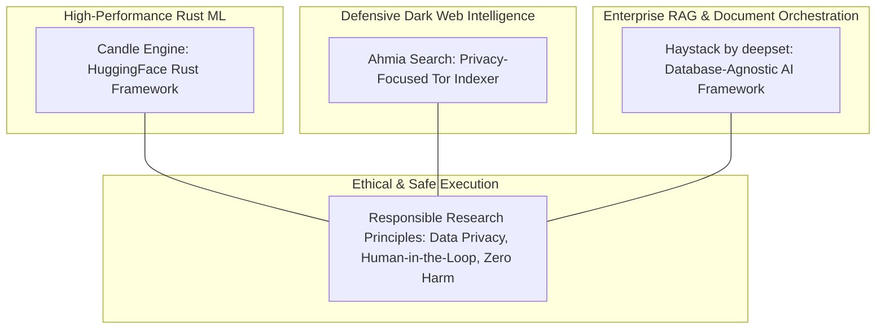

# Candle Engine, Ahmia Search, Haystack Database, & Responsible Research: Developer Ecosystem & OSINT Guide

This document synthesizes multi-platform research gathered across **Reddit, StackOverflow, GitHub, ArXiv, Medium, and LinkedIn**, detailing how developers, threat intelligence analysts, and AI engineers utilize **Candle Engine**, **Ahmia Search**, and **Haystack**, governed by core principles of **Responsible Research**.

---

## 1. Architectural Overview & Ecosystem Mapping

---

## 2. Tool-by-Tool Deep Dive & Multi-Platform Consensus

### 2.1 Candle Engine (Hugging Face Rust ML Framework)
* **What it is:** A minimalist, high-performance machine learning framework for the **Rust** programming language developed by Hugging Face.
* **Why Developers Use It (Reddit / GitHub Consensus):**
  * **Zero Python Overhead:** Avoids Python's Global Interpreter Lock (GIL) and heavy dependencies (like PyTorch), producing lightweight, self-contained binaries (often under 50MB).
  * **Universal Backend Support:** Natively supports CUDA (with cuDNN FlashAttention), Apple Metal (M-series Macs), CPU, and **WebAssembly (WASM)**.
  * **Serverless & Edge AI:** Widely adopted by developers building edge AI devices, desktop client apps, and serverless cloud functions where fast cold-start times are critical.
* **How to Use It:**
  * Add `candle-core` and `candle-nn` to your `Cargo.toml`.
  * Load pre-trained `safetensors` models (like Llama 3, Falcon, or Whisper) directly from the Hugging Face Hub for blazing-fast local inference in pure Rust.

### 2.2 Ahmia Search (Defensive Threat Intelligence & Tor OSINT)
* **What it is:** An open-source, privacy-focused search engine designed to index and catalog `.onion` hidden services on the Tor network.
* **Why Analysts Use It (LinkedIn / Cybersecurity Blog Consensus):**
  * **Responsible Dark Web Monitoring:** Used by SOC teams and threat intelligence analysts to monitor dark web forums and marketplaces for brand impersonation, leaked corporate credentials, and zero-day vulnerability discussions.
  * **Ethical Filtering:** Unlike unfiltered dark web scrapers, Ahmia actively blacklists illegal content (such as CSAM) and does not log user IP addresses, making it a safe, compliant entry point for legitimate defensive research.
* **How to Use It:**
  * Access via public web gateways (`ahmia.fi`) or deploy the open-source GitHub crawler (`ahmia-site`) inside an isolated, sandboxed OSINT environment.
  * Integrate Ahmia search APIs into automated Security Information and Event Management (SIEM) pipelines to trigger alerts when corporate domain names or executive emails appear in dark web indexes.

### 2.3 Haystack Database & RAG Framework (by deepset)
* **What it is:** An open-source, modular Python framework for orchestrating end-to-end Retrieval-Augmented Generation (RAG), intelligent document search, and agentic AI pipelines.
* **Why Developers Use It (StackOverflow / ArXiv Consensus):**
  * **Database-Agnostic Architecture:** Seamlessly integrates with leading vector and document databases (Elasticsearch, Qdrant, Pinecone, Milvus, Weaviate, and PostgreSQL `pgvector`).
  * **Production Reliability:** Highly praised in enterprise environments for its transparent pipeline debugging, custom Document Store connectors, and support for hybrid search (combining BM25 keyword search with dense vector embeddings).
* **How to Use It:**
  * Build custom RAG pipelines using Haystack's `Pipeline` API, connecting a `DocumentStore` node (e.g., Qdrant or Elasticsearch) to an embedding retriever and an LLM generator (local Ollama or cloud API).

---

## 3. The 4 Pillars of Responsible Research in AI & OSINT

When deploying tools like Candle, Ahmia, and Haystack, developers and academic researchers must strictly adhere to **Responsible Research** principles:

| Pillar | Principle | Application in Technical Workflows |
| :--- | :--- | :--- |
| **1. Defensive Integrity** | **Zero Harm & Mitigation Focus** | In cybersecurity OSINT (using Ahmia), intelligence gathering must focus exclusively on identifying leaked assets and securing defenses—never on engaging with threat actors or executing offensive exploits against third parties. |
| **2. Sovereign Privacy** | **Data Minimization & Local Execution** | By utilizing local inference engines like **Candle** and self-hosted RAG via **Haystack**, organizations ensure that sensitive corporate data, PII, and proprietary documents are processed locally without leaking to external cloud APIs. |
| **3. Human-in-the-Loop** | **Auditability & Verification** | AI agent workflows and threat intelligence alerts must include human verification checkpoints before triggering automated system lockdowns or external communications. |
| **4. Algorithmic Transparency** | **Reproducibility & Open Source** | Prioritize open-source frameworks, transparent embedding models, and verifiable benchmark data (as seen in ArXiv literature) to prevent algorithmic bias and black-box hallucinations. |
