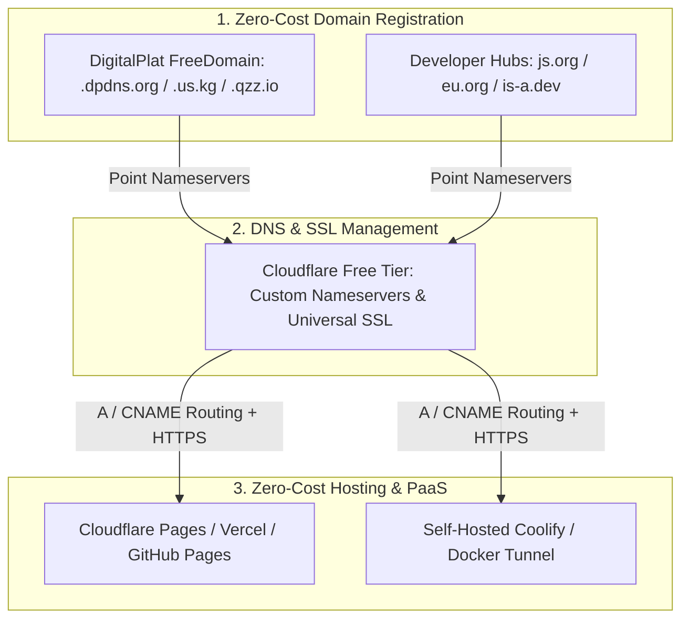

# DigitalPlat & Zero-Cost Domain Hosting Ecosystem

This document synthesizes multi-platform developer research across **GitHub, Reddit (r/selfhosted), LinkedIn, and Medium**, mapping the architecture of **DigitalPlat (DigitalPlat FreeDomain)** and cataloging the modern $0/month domain and hosting stack for AI solopreneurs.

---

## 1. Architectural Architecture: The Zero-Cost Solopreneur Stack

By combining non-profit domain registrars with modern Edge DNS and static/serverless hosting engines, solopreneurs can deploy production-ready AI applications, landing pages, and portfolios without paying recurring domain or server fees.

> [!NOTE] What is DigitalPlat?
> **DigitalPlat FreeDomain** is an open-source, non-profit initiative and community-driven digital identity platform. Its core mission is to remove the financial barrier of domain ownership by providing developers and solopreneurs with 100% free domain registration and custom DNS routing.

---

## 2. Master Comparative Matrix: Free Domain & Subdomain Platforms

When launching a validation experiment from your [[AI_Solopreneur_Viral_Launchpad_and_Free_Alternatives_Plan]], choose your domain provider based on your technical stack and branding requirements:

| Platform / Service | Offered Extensions / Domains | Primary Target Audience | DNS / Nameserver Control | Reliability & Best Use Case |
| :--- | :--- | :--- | :--- | :--- |
| **DigitalPlat** | `.dpdns.org`, `.us.kg`, `.qzz.io`, `.xx.kg` | AI Solopreneurs, Self-Hosters, SaaS Builders | Full Custom Nameservers (Cloudflare / Hostry) | **High.** Best for custom SaaS landing pages and self-hosted lab routing via Cloudflare SSL. |
| **JS.ORG** | `.js.org` | JavaScript Developers, Open-Source Creators | CNAME via GitHub Pull Request | **High.** The gold standard for JavaScript web apps and developer documentation hosted on GitHub Pages. |
| **EU.ORG** | `.eu.org` | General Web Builders, Hobbyists | Full Custom Nameservers via `nic.eu.org` | **High (Since 1996).** Highly respected, permanent free domain, though initial manual registration approval can take days/weeks. |
| **is-a.dev / thedev.id**| `.is-a.dev`, `.thedev.id` | Software Engineers, Portfolio Websites | CNAME / A Records via Automated GitHub Bot | **Medium-High.** Instant setup via GitHub; ideal for developer portfolios and quick demo environments. |
| **DuckDNS** | `.duckdns.org` | Home Lab Engineers, IoT, Dynamic IP | Automated Dynamic DNS Updating Script | **High.** Essential for routing traffic to home servers or local virtual machines when ISP IP addresses change dynamically. |
| **Legacy (biz.nf / free-domain.org)** | `.co.nf`, `.c1.biz` | Legacy PHP/FTP Hobbyists | Limited / Bundled Shared Hosting | **Low.** Often riddled with forced ads or deprecated infrastructure. Modern developers avoid these in favor of DigitalPlat + Cloudflare. |

---

## 3. Standard Operating Procedure (SOP): Launching with DigitalPlat + Cloudflare

To deploy a custom AI web app or landing page at **$0/month** with full HTTPS encryption and instant indexing, execute this standardized deployment protocol:

### Step 1: Register Your Free Domain on DigitalPlat
1. Visit the official DigitalPlat GitHub / community portal and request your domain (e.g., `my-viral-saas.us.kg` or `ai-project.dpdns.org`).
2. In the domain dashboard, select **Custom Nameservers**.

### Step 2: Integrate Cloudflare Universal SSL
1. Log into your free Cloudflare account and click **Add Site** ➔ enter your new DigitalPlat domain.
2. Select the **Free Plan** and copy the two assigned Cloudflare Nameservers (e.g., `ada.ns.cloudflare.com` and `bob.ns.cloudflare.com`).
3. Paste these nameservers back into your DigitalPlat management panel. Within 5–15 minutes, Cloudflare will assume DNS authority.

### Step 3: Deploy & Route Traffic
1. In Cloudflare DNS settings, create a **CNAME Record** pointing `@` (root) to your hosting provider:
   * For **Cloudflare Pages / GitHub Pages:** Point to `yourusername.github.io` or `project.pages.dev`.
   * For **Self-Hosted Labs:** Point to your [[Open_Source_AI_Stack_and_Agent_Ecosystem_Research]] Coolify / Cloudflare Tunnel endpoint.
2. Ensure Cloudflare SSL/TLS mode is set to **Full (Strict)**. Your zero-cost domain is now live with enterprise-grade SSL and DDoS protection!

> [!TIP] Instant Google & Bing Indexing
> As soon as your DigitalPlat domain is live, run your automated indexing script from [[NextGen_SEO_and_Instant_Indexing]] (`python submit_indexnow.py` and `python submit_gsc_indexing.py`) to force search engines to crawl and rank your new platform within hours!

---

## 4. Related Knowledge Vault Links (Obsidian Graph)
Connect this zero-cost infrastructure to your broader engineering pipelines:
* [[AI_Solopreneur_Viral_Launchpad_and_Free_Alternatives_Plan]] — Pairing free DigitalPlat domains with viral video marketing and n8n DM automation.
* [[Open_Source_AI_Stack_and_Agent_Ecosystem_Research]] — Hosting Dify, Langflow, and Coolify apps on free subdomains.
* [[NextGen_SEO_and_Instant_Indexing]] — SEO ranking strategies for new `.us.kg` and `.dpdns.org` domains.
* [[Start_Me_OSINT_Dashboards_and_Automated_Tooling]] — CNAME routing for custom OSINT bookmark portals.
