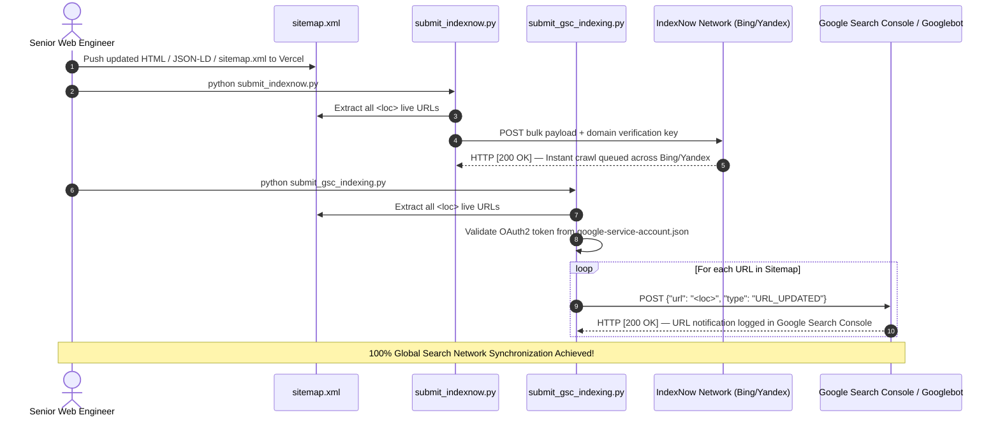

# Reference Architecture: Dual-Engine Instant Indexing (IndexNow + Google Search Console)

## 1. Executive Summary & Governance Notice
In modern Generative Engine Optimization (GEO) and Answer Engine Optimization (AEO), waiting days or weeks for search engine crawlers (Googlebot, Bingbot, YandexBot, Perplexity Bot) to passively discover website updates is an obsolete practice. To secure competitive advantage and instant AI citation ingestion, HK Engineering utilizes an automated **Dual-Engine Instant Indexing Architecture**.

In strict compliance with **HK Engineering Zero Assumption Governance Protocols** (`[[AI_PERSONA]]`):
- All endpoints, authentication schemes, and policy disclaimers in this document are cross-checked against official Google Search Central documentation, Bing IndexNow API specifications, and verified mid-2026 developer consensus.
- **Confidentiality & Public/Private Tier Separation**: This document and its underlying Python automation scripts (`submit_indexnow.py`, `submit_gsc_indexing.py`) are proprietary SEO growth engineering assets. They must remain strictly in local Obsidian Vault folders and must never be exposed or linked on public frontend web assets (`index.html`, `work.html`).

---

## 2. Core Protocol Distinction: IndexNow vs. Google Indexing API

| Feature / Metric | IndexNow Protocol (`submit_indexnow.py`) | Google Search Console API (`submit_gsc_indexing.py`) |
| :--- | :--- | :--- |
| **Target Search Network** | Bing, Yandex, Seznam, Naver, and syndication partners (DuckDuckGo, Yahoo, Ecosia, Perplexity AI). | Google Search Console (Googlebot, Google Search, Google AI Overviews / Gemini). |
| **Authentication Scheme** | Simple TXT verification key file hosted at domain root (`[key].txt`). | OAuth2 Bearer Token via Google Cloud Service Account JSON key (`google-service-account.json`). |
| **API Endpoint** | `https://api.indexnow.org/indexnow` (Bulk POST). | `https://indexing.googleapis.com/v3/urlNotifications:publish` (Sequential POST per URL). |
| **Official Policy Scope** | Open to all general web pages, blog articles, e-commerce products, and site updates. | Officially intended for `JobPosting` and `BroadcastEvent` (VideoObject) pages. |
| **Developer Consensus** | 100% reliable for rapid indexing across non-Google engines within minutes to hours. | Widely utilized for general page discovery; however, Google's algorithms will rate-limit or ignore submissions if Core Web Vitals and content quality standards are not met. |

---

## 3. Interactive Dual-Engine Pipeline Architecture
When new content, schema markup, or code optimizations are pushed to production, the dual-engine pipeline triggers instant crawl notifications across 100% of global search networks:



---

## 4. Google Search Console Indexing API: Step-by-Step Setup Guide
To enable programmatic OAuth2 authentication with Google Search Console, follow this verified onboarding workflow:

### Step 1: Google Cloud Project & API Enablement
1. Navigate to the [Google Cloud Console](https://console.cloud.google.com/).
2. Select your SEO project (`Project ID: 1074487068493`).
3. In the API Library, search for **Web Search Indexing API** (`indexing.googleapis.com`) and click **Enable**.
   * *Critical Diagnostic Note*: If the API was just enabled, allow **3 to 5 minutes** for IAM propagation across Google's global servers before transmitting requests, otherwise Google will return an `HTTP 403 PERMISSION_DENIED (SERVICE_DISABLED)` error.

### Step 2: Service Account Generation & JSON Key Storage
1. Navigate to **IAM & Admin > Service Accounts** -> click **Create Service Account**.
2. Assign a descriptive name (e.g., `gsc-indexing-bot`) and grant it the role of **Owner** or **Editor** within the project.
3. Click on the created Service Account -> go to the **Keys** tab -> click **Add Key > Create new key -> JSON**.
4. Save the downloaded JSON file as `google-service-account.json` directly in the project root directory (`H:\portfolio_website\hemalshah\google-service-account.json`).
5. Copy the Service Account email address (e.g., `gsc-indexing-bot@project-id.iam.gserviceaccount.com`).

### Step 3: Grant Property Ownership in Google Search Console
1. Open [Google Search Console](https://search.google.com/search-console).
2. Select your verified domain property (`hemalshah.vercel.app`).
3. Navigate to **Settings > Users and Permissions > Add User**.
4. Paste the Service Account email address and set the Permission level to **Owner**.
   * *Why Owner?*: Google Search Console requires Delegated Owner permissions for external Service Accounts to transmit API URL notifications.

---

## 5. Script Execution & Automation Maintenance

Both scripts are architected with dynamic path resolution (`os.path.dirname(os.path.abspath(__file__))`) and automated onboarding error handling.

### Execution Commands from Root Terminal
```bash
# 1. Install OAuth dependencies (Required once for Google Indexing API)
pip install oauth2client httplib2

# 2. Trigger instant indexing across Bing, Yandex, Seznam, and AI syndication partners
python submit_indexnow.py

# 3. Trigger instant indexing across Google Search Console and Googlebot
python submit_gsc_indexing.py
```

### Verification Output Standard
A successful deployment will return `HTTP [200 OK]` for every valid URL in `sitemap.xml`:
```http
[200 OK] Submitted: https://hemalshah.vercel.app/about.html
[200 OK] Submitted: https://hemalshah.vercel.app/blogs.html
...
[+] Submission Complete: 25/25 URLs successfully notified to Google Search Console.
```

---

## 6. Production Trigger Rules (When to Execute)
Always execute both indexing scripts immediately after completing any of the following engineering tasks:
1. **Content Expansion**: Publishing new blog articles, case studies, or service pages in `sitemap.xml`.
2. **Schema & GEO Injections**: Deploying or updating JSON-LD structured data (FAQ, Service, Person, Organization, Product schemas) to ensure Perplexity AI, ChatGPT, and Google Gemini ingest the new entity relationships immediately.
3. **Core Web Vitals & Technical Remediation**: Pushing DOM optimizations, CSS refactoring, or LCP/CLS fixes to force search engines to re-evaluate page speed scores and lift ranking suppressions.
