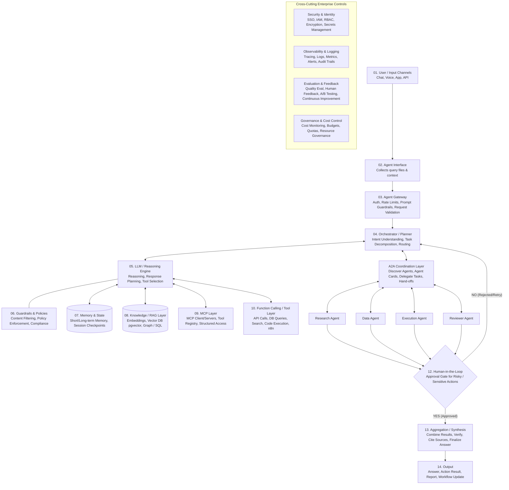

# Enterprise Autonomous Agent & Multi-Agent System (MAS) Reference Architecture

## 1. Overview & Attribution
This document synthesizes the comprehensive 14-layer enterprise reference architecture for autonomous AI agents and Multi-Agent Systems (MAS), originally mapped by **Prashant Rathi (@prashantrathl1)**. 

This architecture serves as the foundational engineering blueprint for HK Engineering's enterprise AI consulting deployments and our future **In-Browser MAS Coding SaaS (`[[browser_mas_saas]]`)**.

---

## 2. Interactive System Workflow Diagram (Mermaid)



---

## 3. The 14 Sequential Execution Layers

### 01. User / Input Channels
The entry points where end-users or external systems initiate interaction: **Chat interfaces, Voice assistants, Web & Mobile Apps, and REST/Webhook APIs**.

### 02. Agent Interface
Responsible for normalizing input: **collecting user query files, session context, environment variables, and metadata** before passing them into the secure gateway.

### 03. Agent Gateway
The perimeter firewall of the AI system. Enforces:
- **Authentication & Authorization** (API keys, OAuth tokens).
- **Rate Limiting & DDOS Protection**.
- **Prompt Guardrails & Request Validation** (blocking injection attacks and malformed payloads).

### 04. Orchestrator / Planner
The central conductor of the agent workflow. Executes:
- **Intent Understanding & Semantic Classification**.
- **Task Decomposition** (breaking complex goals into atomic subtasks).
- **Dynamic Routing & Planning** (deciding whether to answer directly, query RAG, or delegate to specialized subagents).

### 05. LLM / Reasoning Engine
The cognitive core (e.g., Claude 3.5 Sonnet, GPT-4o, DeepSeek, Gemini). Responsible for **deep reasoning, multi-step response planning, and dynamic tool selection**.

### 06. Guardrails & Policies
Works in tandem with the reasoning engine to enforce runtime compliance: **content filtering, output redaction, prompt guardrail verification, and strict organizational policy enforcement**.

### 07. Memory & State (Bi-directional `++`)
Maintains conversation continuity and context:
- **Short-term Memory**: Active session working context and scratchpad.
- **Long-term Memory**: Cross-session durable preferences and historical learnings.
- **Session State & Checkpoints**: Ability to pause, rollback, or resume complex agent workflows.

### 08. Knowledge / RAG Layer (Bi-directional `++`)
Provides domain intelligence without hallucinations:
- **Embeddings & Vector Databases** (e.g., PostgreSQL + `pgvector` with HNSW indexing).
- **Document Stores & Graph / SQL Knowledge Bases**.

### 09. Model Context Protocol (MCP) Layer (Bi-directional `++`)
The standardized bridge between LLMs and external tools: **MCP clients, MCP servers, dynamic tool registries, and structured tool access permissions**.

Based on **Ujjyaini Mitra's 7 MCP Architectural Patterns**, this layer implements:
1. **Tool Specialist**: Exposing high-level, lean API actions rather than raw Swagger mirroring (e.g., `analyze_and_fix_bug`).
2. **Context Giver**: Injecting structured organizational RAG documents directly into the prompt context at execution time.
3. **Unified Gateway**: A centralized proxy (Vercel Edge / Envoy) handling MCP routing, rate limits, and OAuth authentication.
4. **Persistent Session Manager**: Tracking multi-turn agent interaction state across databases and file systems asynchronously via HTTP headers.
5. **Sandboxed Keeper**: Encapsulating risky tool execution (bash, code compilation) inside isolated micro-VMs (e.g., Firecracker, Modal).
6. **Workflow Coordinator**: Bridging non-deterministic LLM reasoning with deterministic pipelines (e.g., GitHub PR -> CI/CD trigger -> Slack alert).
7. **Autonomous Reasoner**: Enabling Sub-Agents to autonomously loop over MCP tools for independent research before returning results to the orchestrator.

### 10. Function Calling / Tool Layer (Bi-directional `++`)
The execution arm that interacts with the real world: **REST API calls, SQL database queries, web search execution, local/cloud sandbox code execution, and n8n workflow actions**.

### 11. Specialized Agents & A2A Coordination Layer
When a task exceeds single-prompt capabilities, the Orchestrator delegates to a **Multi-Agent System (MAS)**:
- **A2A (Agent-to-Agent) Coordination Layer**: Manages agent discovery, reads Agent Cards (capabilities), delegates tasks, executes hand-offs, and drives peer collaboration.
- **Specialized Workers**:
  - **Research Agent**: Deep web searches, repo exploration, and document scraping.
  - **Data Agent**: SQL queries, data cleaning, and statistical transformations.
  - **Execution Agent**: Terminal bash commands, git operations, and code compilation.
  - **Reviewer Agent**: Code reviews, security vulnerability audits, and linting checks.

### 12. Human-in-the-Loop (HITL)
An explicit **Approval Gate** for high-risk or sensitive operations (e.g., production database migrations, executing financial transactions, or deploying code to live servers).
- **YES**: Proceeds to aggregation.
- **NO**: Rejects action and loops back to the Orchestrator with corrective feedback.

### 13. Aggregation / Synthesis
Receives outputs from multiple specialized agents or tool calls, **combines results, verifies accuracy against source documents, formats citations, and synthesizes the finalized answer**.

### 14. Output
Delivers the final payload back to the user or calling channel: **conversational answers, executed action results, structured markdown reports, or webhook workflow updates**.

---

## 4. Cross-Cutting Enterprise Controls

These four architectural pillars operate continuously across all 14 layers to guarantee enterprise-grade reliability and compliance:

| Control Pillar | Core Components & Responsibilities |
| :--- | :--- |
| **1. Security & Identity** | Single Sign-On (SSO), Identity & Access Management (IAM), Role-Based Access Control (RBAC), end-to-end payload encryption, and secure API secrets management (e.g., Vault / AWS Secrets Manager). |
| **2. Observability & Logging** | Distributed request tracing (OpenTelemetry), structured JSON logs, latency & error rate metrics, real-time alerting, and immutable audit trails for compliance. |
| **3. Evaluation & Feedback** | Automated LLM-as-a-Judge quality evaluations, Human Feedback collection (RLHF/thumbs up/down), A/B prompt testing, and continuous accuracy improvement loops. |
| **4. Governance & Cost Control** | Real-time API cost monitoring, user/team token budgets and rate quotas, prompt caching optimization, and compute resource governance to prevent runaway LLM spending. |

---

## 5. Implementation Mapping at HK Engineering & PR Marketing Ventures

When building custom client systems or our **In-Browser MAS Coding SaaS (`[[browser_mas_saas]]`)**, we map this reference architecture directly to our preferred technology stack:

```text
Layer 01-03 (Gateway)    ➔ Vercel Edge / Cloudflare Workers + FastAPI Security Middleware
Layer 04-05 (Reasoning)  ➔ Python FastAPI Async Orchestrator + Claude 3.5 / OpenAI APIs
Layer 07-08 (Memory/RAG) ➔ PostgreSQL (pgvector HNSW) + Local Obsidian Markdown Vault
Layer 09-10 (Tools/MCP)  ➔ n8n Workflow Automation + Custom MCP WebSockets Server
Layer 11 (MAS Agents)    ➔ LangGraph / Async Python Workers inside E2B / Daytona Micro-VMs
Cross-Cutting Controls   ➔ OpenTelemetry Tracing + Sentry + Strict Token Budget Quotas
```
