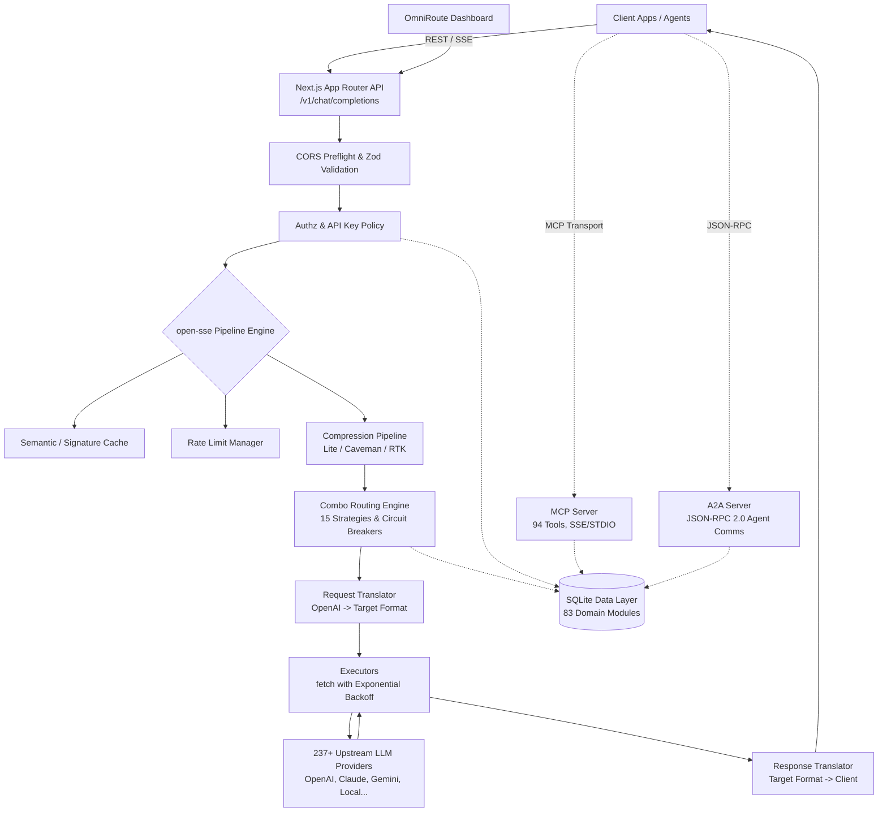

# OmniRoute Architecture & Reverse Engineering Graph

**Source**: `C:\hk\omniroute`
**Type**: Architecture Knowledge Base & Graph
**Date**: 2026-07-31

---

## 1. System Overview

**OmniRoute** is a highly resilient, unified AI router and proxy that multiplexes LLM requests across **237+ provider endpoints** (OpenAI, Anthropic, Gemini, Groq, local models, etc.). It acts as a universal gateway supporting OpenAI-compatible formats and provides advanced features such as proactive prompt compression, multi-agent communication (A2A), Model Context Protocol (MCP), and reasoning-replay logic.

### Core Stack
- **Runtime & Framework**: Next.js 16 (App Router), Node.js (>= 22.0.0), ES Modules.
- **Database**: SQLite (`better-sqlite3`) utilizing 83 domain-specific modules and WAL journaling.
- **Styling**: Tailwind CSS v4, single-source-of-truth token system (`globals.css`), `.dark` mode via Zustand.
- **Packaging**: Web interface + Electron Desktop app.

---

## 2. Architecture Graph (Mermaid)

---

## 3. Core Subsystems

### A. Request Pipeline (`open-sse/`)
The heart of OmniRoute is the `open-sse` request pipeline.
1. **Cache & Rate Limits**: Ingress requests check semantic signatures and API quotas.
2. **Combo Engine (`open-sse/services/combo.ts`)**: Solves model routing dynamically. Uses 15 distinct strategies (Round-robin, P2C, Fill-first, Cost-optimized, etc.) to evaluate arrays of target providers (`ResolvedComboTarget[]`).
3. **Translator (`open-sse/translator/`)**: Detects the original format of the request and translates it to the specific API structure of the upstream target.
4. **Executor (`open-sse/executors/`)**: Safely dispatches the translated body with circuit breaking and exponential backoff retry logic.

### B. Proactive Prompt Compression (`open-sse/services/compression/`)
Runs *before* the context manager limits are hit to minimize token bloat:
- **Lite Mode**: Whitespace collapse, deduplication, URL trimming (10-15% savings, <1ms).
- **Caveman Mode**: Semantic condensation via file-loaded language packs.
- **RTK Mode**: Terminal/Tool-output JSON DSL pattern compression (strips ANSI and raw code noise while retaining error context).

### C. Protocol Servers
- **MCP Server (`open-sse/mcp-server/`)**: 94 registered tools covering Memory, OS Skills, Gamification, Plugin management, Notion, and Obsidian. Runs via standard STDIO, SSE, or Streamable HTTP.
- **A2A Server (`src/lib/a2a/`)**: Agent-to-Agent v0.3 Server handling synchronous and asynchronous task management via JSON-RPC 2.0.

### D. Data Layer (`src/lib/db/`)
- Relies purely on **SQLite** with strict domain module isolation (83 distinct files).
- Handled through `core.ts` singleton and versioned via `migrationRunner.ts` (97+ migration phases).
- **Security**: Heavily uses encryption keys for API tokens at rest. Never interpolates raw values.

### E. Frontend Design System (`src/app/globals.css`)
- **Single Source of Truth**: All UI elements derive from `globals.css` Tailwind v4 tokens (`--color-surface`, `--color-primary`, `--grid-size: 32px`).
- **Graph-Paper UI**: A unified graph-paper grid background is implemented globally at `body::before` across both dashboard and auth views.
- **Strict Bypassing Audits**: No raw `#hex` or `rgba` are allowed for colors; UI relies on CSS primitives and tailwind-merge (`cn`).

---

## 4. Notable Engineering Patterns
- **Doc Accuracy Discipline**: OmniRoute has strict CI gates (`npm run check:fabricated-docs`) to ensure documentation never lies. You cannot name an API or file in docs if a codebase `grep` returns 0 hits.
- **Reasoning Replay**: The system intercepts and locally caches `<think>` or `reasoning_content` blocks for strict upstream models (e.g., DeepSeek R1/V4), re-injecting them seamlessly during multi-turn chats.
- **Guardrails**: Contains hot-reloadable fail-open security guards, primarily for PII redaction and prompt-injection masking (`src/lib/guardrails/`).
