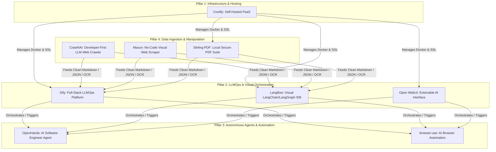

# Open-Source AI Stack, Autonomous Agents, and Self-Hosted Infrastructure: Comprehensive Research & Ecosystem Guide

This document synthesizes developer consensus, academic research (including ICLR 2025 literature), architectural paradigms, and practical deployment workflows for nine foundational tools in the modern open-source AI and self-hosted ecosystem: **Coolify**, **OpenHands**, **Maxun**, **Open WebUI**, **browser-use**, **Langflow**, **Stirling-PDF**, **Crawl4AI**, and **Dify**.

---

## 1. Executive Summary & Architectural Classification

The nine tools evaluated in this research represent four distinct pillars of a modern, self-hosted AI engineering stack:



---

## 2. Deep-Dive Tool Analysis & Developer Consensus

### 2.1 Coolify (Self-Hosted Infrastructure & PaaS)
* **Overview:** An open-source, self-hostable Platform-as-a-Service (PaaS) designed as an alternative to Vercel, Heroku, and Netlify.
* **Developer Consensus:** Widely celebrated in home-lab and startup developer communities for removing the friction of DevOps. Developers praise its seamless management of Docker containers, automated SSL/TLS provisioning via Let's Encrypt, Git-based automated deployments, and built-in database management (PostgreSQL, Redis, MySQL).
* **How to Utilize:** 
  * Deploy Coolify on a bare-metal Linux VPS (Ubuntu/Debian) via its single-line installation script.
  * Use Coolify as the central control plane to host all other services in this vault (such as Dify, Langflow, Stirling-PDF, and Open WebUI) using one-click Docker Compose templates or custom Git repositories.

### 2.2 OpenHands (Autonomous AI Software Engineer)
* **Overview:** Formerly known as OpenDevin, OpenHands is a premier open-source platform for autonomous AI software engineering agents capable of writing code, running terminal commands, browsing the web, and debugging software.
* **Research Paper & Literature:** Featured prominently in AI agent literature (including ICLR 2025 submissions and benchmarks). The academic research focuses on its modular event-stream architecture, sandboxed Docker execution environments for safe code execution, and benchmark performance on industry standards like **SWE-bench** (real-world GitHub issue resolution) and **WebArena**.
* **Developer Consensus:** Recognized as the industry standard for open-source coding agents. Developers value its extensibility, multi-modal interaction capabilities, and the separation between the agent reasoning engine and the isolated execution sandbox.
* **How to Utilize:**
  * Run locally via Docker or deploy via Coolify to provide autonomous GitHub bug fixing and automated test generation.
  * Connect OpenHands to local or cloud LLM endpoints (via Ollama or LiteLLM) to act as a self-hosted pair programmer or automated DevOps engineer.

### 2.3 Crawl4AI vs. Maxun (Web Data Ingestion & Scraping)

| Feature | Crawl4AI | Maxun |
| :--- | :--- | :--- |
| **Primary Paradigm** | Developer/Code-First Python Library | No-Code / Visual Robot Training Platform |
| **Target Audience** | AI Engineers, Data Scientists, RAG Developers | Growth Teams, Non-Technical Users, Rapid Prototyping |
| **Output Optimization** | LLM-ready clean Markdown, JSON, structured schemas | Structured table extraction, automated pagination |
| **Anti-Bot & Performance** | Extremely fast parallel crawling, custom browser headers | Visual point-and-click recorder, browser automation |

* **Crawl4AI Developer Consensus:** Considered the "gold standard" for Python developers building Retrieval-Augmented Generation (RAG) pipelines. Developers emphasize its incredible speed (async Playwright/Chromium engine), its ability to strip DOM noise and output clean Markdown specifically formatted for LLM context windows, and advanced semantic chunking capabilities.
* **Maxun Developer Consensus:** Highly rated by developers who want to empower non-technical team members or bypass the maintenance of complex CSS/XPath selectors. By "training a robot" via clicks in a live browser session, Maxun eliminates script fragility.
* **How to Utilize:**
  * Use **Crawl4AI** as the automated ingestion engine inside your Python backend or Dify/Langflow workflows to crawl documentation sites and populate vector databases.
  * Use **Maxun** for scheduled scraping of e-commerce pricing, job boards, or competitor portals without writing scraper code.

### 2.4 Dify vs. Langflow (LLM Application Orchestration & LLMOps)

| Feature | Dify | Langflow |
| :--- | :--- | :--- |
| **Core Philosophy** | Full-Stack LLMOps & Production AI Product Suite | Visual IDE & Orchestrator for LangChain / LangGraph |
| **Best For** | Enterprise production, team collaboration, out-of-the-box RAG | Custom Python prototyping, granular LangGraph workflows |
| **Export Capability** | REST APIs, embeddable widgets, JSON DSL | Python code export (compiles directly to LangChain code) |
| **Governance & Ops** | Built-in observability, prompt management, rate limiting | Focuses on flow execution; requires external ops tools |

* **Dify Developer Consensus:** Favored by teams who want an "all-in-one" AI application server. Developers praise its robust built-in RAG engine (with hybrid search and reranking), intuitive promptIDE, and enterprise-grade observability without needing to stitch together separate microservices.
* **Langflow Developer Consensus:** Beloved by Python developers who live in the LangChain/LangGraph ecosystem. Unlike rigid UI builders, Langflow provides "code-level escape hatches," allowing engineers to write custom Python nodes and export visual workflows into clean, maintainable Python code for production deployment.
* **How to Utilize:**
  * Host **Dify** on Coolify as your organization's primary AI backend to serve customer-facing chatbots, internal knowledge search, and API endpoints.
  * Use **Langflow** as a rapid research and prototyping canvas for designing complex multi-agent architectures before compiling them into production Python services.

### 2.5 browser-use (AI Agent Web Automation)
* **Overview:** An open-source Python library that connects LLMs to web browsers, enabling autonomous agents to navigate websites, click buttons, fill out forms, and extract information using natural language reasoning.
* **Developer Consensus:** Celebrated as a major leap forward over brittle Selenium/Playwright scripts. Because the agent uses visual and DOM-based reasoning (via vision-language models or DOM snapshotting), it dynamically adapts to website layout changes. Developers frequently pair it with local **Ollama** models for private, zero-cost web automation.
* **How to Utilize:**
  * Integrate into custom Python scripts to perform complex multi-step web research, automated QA testing of web applications, or autonomous data entry.
  * Pair with local LLMs (Qwen 2.5, Llama 3) via Ollama to automate web tasks without sending sensitive data to third-party cloud APIs.

### 2.6 Open WebUI (Extensible AI Control Center)
* **Overview:** A self-hosted, feature-rich web interface designed to interact with local Ollama instances and OpenAI-compatible APIs.
* **Developer Consensus:** Widely considered the best self-hosted frontend for local LLMs. Developers praise its ChatGPT-like user experience, built-in document RAG (uploading PDFs/docs directly into chat), multi-user role management, web search integration, and custom tool/function calling capabilities.
* **How to Utilize:**
  * Deploy as the primary user-facing chat portal for your team or home lab, connecting it to local Ollama GPUs and remote LLM providers.
  * Utilize its plugin architecture to connect custom web search tools (like Crawl4AI) or orchestration pipelines (Dify/Langflow) directly into the chat interface.

### 2.7 Stirling-PDF (Local Secure Document Processing)
* **Overview:** A robust, self-hosted web application running as a Docker container that performs extensive PDF manipulation (merge, split, OCR, compress, convert, sign, and redact).
* **Developer Consensus:** A staple in privacy-conscious developer setups and enterprise self-hosted environments. Developers emphasize that unlike online PDF utilities (which pose data privacy risks), Stirling-PDF ensures that sensitive financial, legal, and personal documents never leave the local network or server.
* **How to Utilize:**
  * Deploy via Coolify as an internal document utility hub.
  * Integrate its API endpoints into data ingestion pipelines (prior to feeding documents into Crawl4AI or Dify RAG pipelines) to perform OCR on scanned PDFs or split large documents into optimized chunks.

---

## 3. Unified Integration Workflow: Building the Self-Hosted AI Ecosystem

To maximize the synergy between these tools, implement the following end-to-end architecture within your infrastructure:

```
[ Coolify (PaaS / Docker Management / Reverse Proxy / SSL) ]
   ├── Hosting ──> Dify (Primary LLMOps & RAG Server)
   ├── Hosting ──> Langflow (Multi-Agent Prototyping IDE)
   ├── Hosting ──> Open WebUI (User Frontend & Chat Portal)
   └── Hosting ──> Stirling-PDF (Document Pre-Processing & OCR)

[ Automated RAG & Data Ingestion Pipeline ]
   Raw Web Pages ──(Crawl4AI / Maxun)──> Clean Markdown / Structured JSON ──┐
   Raw PDF Docs  ──(Stirling-PDF OCR)─> Clean Text / Chunks ──────────────┴──> [ Dify / Langflow Vector DB ]

[ Autonomous Execution & Automation Loop ]
   User Prompt (via Open WebUI / Dify API) ──> Triggers Agent Workflow (Langflow / OpenDevin)
                                                    ├──> Code / System Tasks (OpenHands Sandbox)
                                                    └──> Web Navigation Tasks (browser-use + Ollama)
```

### Best Practices for Deployment & Utilization:
1. **Infrastructure Foundation:** Use **Coolify** as your root dashboard. Deploy Stirling-PDF, Dify, Langflow, and Open WebUI as separate containerized projects within Coolify, ensuring isolated Docker networks and automatic SSL termination.
2. **Document & Web Ingestion:** When building internal knowledge bases, pass raw PDFs through **Stirling-PDF** for OCR and sanitization. For web content, use **Crawl4AI** in your Python ingestion scripts to convert target documentation into clean Markdown before indexing it in Dify's vector database.
3. **Agentic Automation:** For tasks requiring external web actions (like booking, research, or portal scraping), create Python microservices utilizing **browser-use** and expose them as custom API tools inside **Dify** or **Langflow**.
4. **Software Development Automation:** Deploy **OpenHands** with a local Docker sandbox to serve as your autonomous repository maintainer, integrating it with your Git workflows to automatically review pull requests and attempt bug fixes on failing CI/CD pipelines.
