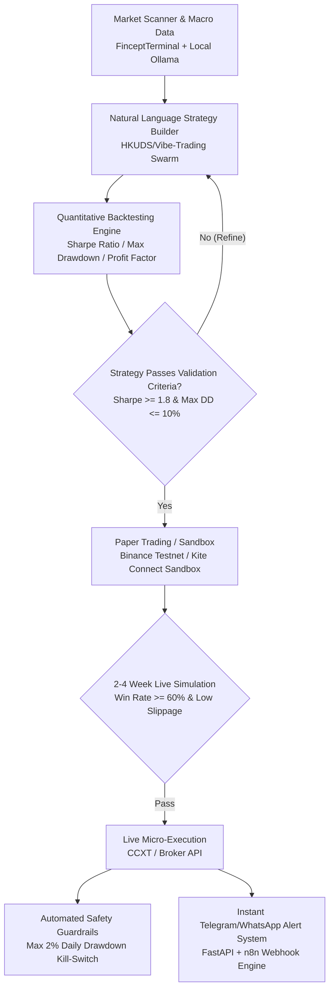

# Personal Algorithmic Trading & Vibe Execution System Architecture

---

## 1. System Overview & Philosophy

This architecture leverages the intersection of **"Vibe Trading" (Natural Language AI Agent Swarms)** and **Open-Source Financial Intelligence Terminals (Fincept Terminal)** for personal algorithmic portfolio management and high-probability trade execution.

---

## 2. Multi-Tier Technology Stack

| Layer | Technology | Role / Responsibility |
|---|---|---|
| **Market Intelligence** | `FinceptTerminal` (C++20/Qt6) | Macro economic indicators, multi-asset technical charts, fundamental valuation ratios. |
| **Local AI Personas** | `Ollama` (Llama-3 / DeepSeek-R1) | Private, offline sentiment scoring, earnings transcript summarization, catalyst detection. |
| **Strategy & Backtest** | `HKUDS/Vibe-Trading` (`vibe-trading-ai`) | Multi-agent investment committee (Macro, Quant, Risk, Catalyst) translating natural language prompts into Python backtests. |
| **Execution Engine** | `FastAPI` + `CCXT` / `KiteConnect` | Order routing, limit order management, trailing stop executions. |
| **Alerts & Monitoring** | `n8n` + `Telegram Bot API` | Real-time push notifications on trade entry, stop-loss adjustments, and daily profit/loss summaries. |

---

## 3. Strict 4-Phase Execution Pipeline

### Phase 1: Natural Language Strategy Formulation
Prompting the multi-agent swarm with structured parameter constraints:
* **Asset Class:** BTC/USDT, ETH/USDT, Nifty 50, BankNifty, S&P 500.
* **Timeframe:** 15m, 1h, 4h.
* **Trigger Conditions:** Technical crossovers (e.g., EMA 20/50), momentum oscillators (RSI divergence), volatility filters (ATR / Bollinger Band squeeze).
* **Exit Conditions:** Fixed or dynamic trailing stop-loss (1.5x ATR), Take-Profit targets (1:2.5 risk-to-reward).

### Phase 2: Quantitative Backtesting Standards
Before any strategy is considered for forward testing, it must meet minimum mathematical thresholds:
* **Minimum Backtest Horizon:** 12–24 months of historical tick/candle data.
* **Sharpe Ratio:** $\ge 1.75$
* **Profit Factor:** $\ge 1.65$
* **Maximum Historical Drawdown:** $\le 10\%$
* **Win Rate:** $\ge 52\%$ (with minimum 1:2 Risk/Reward).

### Phase 3: Forward Paper Trading (2–4 Weeks)
* Connect the execution script to exchange testnets (Binance Testnet, Zerodha Kite Developer Sandbox).
* Track execution latency, order fill slippage, and spread deviations during high-volatility news events.

### Phase 4: Live Execution with Hardcoded Risk Guardrails
* **Daily Drawdown Kill-Switch:** If daily loss reaches **-2.0%**, the script automatically closes open positions, cancels all pending orders, and locks execution for 24 hours.
* **Per-Trade Capital Risk:** Strictly limited to **0.5% - 1.0%** of total account equity per trade.
* **API Security Protocol:**
  * IP-whitelisted API keys only.
  * **Withdrawal permissions permanently disabled** on exchange API management.
  * Encrypted environment variable management via `.env`.

---

## 4. Synergy with Business & Portfolio Consulting

1. **Proof of Work:** Real-world algorithmic trading backtests and automated webhook architectures provide demonstrable proof for prospective enterprise fintech and AI automation clients.
2. **Dual-Use Assets:** Custom data connectors, dashboard components, and n8n notification templates built for personal trading can be packaged into productized consulting deliverables.
