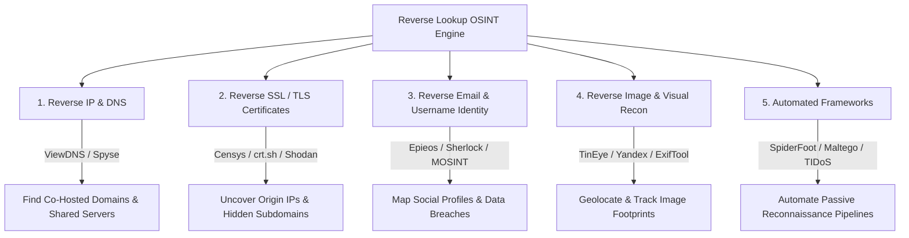

# Reverse Lookup OSINT Methodologies & Threat Intelligence Tools

This document synthesizes multi-platform research gathered across **Reddit, GitHub, StackOverflow, LinkedIn, and Medium**, detailing the industry-standard tools, developer consensus, and operational workflows for conducting **Reverse Lookups** in Open-Source Intelligence (OSINT) and cybersecurity reconnaissance.

---

## 1. Architectural Mapping: The 5 Vectors of Reverse OSINT

In threat intelligence, a "reverse lookup" is the methodology of starting with a single technical artifact or identity data point and working backward to uncover the broader attack surface, associated infrastructure, or digital footprint.



---

## 2. Deep-Dive Vector Analysis & Tool Matrix

### 2.1 Vector 1: Reverse IP & DNS Reconnaissance
* **Methodology:** Queries DNS databases and routing tables to identify all domain names co-hosted on a single IP address or server. This is essential for discovering shared hosting environments, staging servers, and attacker infrastructure.
* **Top Tools (Medium & Reddit Consensus):**
  * **ViewDNS.info:** The industry standard for reverse IP lookups, DNS report generation, and historical WHOIS records.
  * **DNSDumpster:** A free domain research tool that discovers hosts related to a domain through DNS routing analysis and maps them visually.
  * **Spyse / SecurityTrails:** Enterprise internet intelligence engines used to trace historical DNS and IP ownership changes over decades.

### 2.2 Vector 2: Reverse SSL / TLS Certificate Lookup
* **Methodology:** Analyzes Certificate Transparency (CT) logs and internet scanning engines to find web servers sharing the same SSL/TLS certificate hash or organization details. This allows analysts to bypass Cloudflare/CDN protection and discover the true backend origin IP address of a target.
* **Top Tools (LinkedIn & Threat Intelligence Blogs):**
  * **Censys:** An internet intelligence platform that indexes hosts and certificates. Security teams query Censys for SSL fingerprint hashes to find exposed internal infrastructure.
  * **Shodan:** Search engine for internet-connected devices; used to reverse-lookup SSL certificates across IoT devices and exposed ports.
  * **crt.sh:** The primary open-source portal for querying Certificate Transparency logs to enumerate all subdomains ever issued a certificate for a root domain.

### 2.3 Vector 3: Reverse Email & Username Identity Tracking
* **Methodology:** Takes a known email address or username and checks hundreds of online platforms, breach databases, and recovery APIs to build an identity profile.
* **Top Tools (GitHub & Reddit r/OSINT):**
  * **Epieos:** Celebrated as the premier tool for reverse email lookups; checks Google Workspace, Microsoft accounts, and social networks without alerting the target.
  * **Sherlock (`sherlock-project/sherlock`):** A legendary command-line tool on GitHub that hunts down usernames across 300+ social networks and forums.
  * **MOSINT:** An automated email OSINT tool written in Go that checks email verification, social accounts, and breach databases (HaveIBeenPwned).
  * **Whatsmyname.app:** A web-based username enumeration tool powered by an open-source JSON dataset.

### 2.4 Vector 4: Reverse Image & Visual OSINT
* **Methodology:** Analyzes image pixels, metadata (EXIF data), and visual landmarks to find where an image originates or where else it appears across the surface and dark web.
* **Top Tools:**
  * **TinEye & Yandex Images:** The most effective search engines for reverse image matching and facial/landmark recognition in OSINT investigations.
  * **ExifTool (`exiftool`):** The definitive command-line utility for extracting hidden metadata (GPS coordinates, camera serial numbers, timestamps) from image and audio files.

---

## 3. SOP: Automated Reverse Lookup Pipeline in Kali Linux

To execute a comprehensive, passive reverse lookup investigation inside your VirtualBox Kali Linux VM without directly touching the target's servers, run this standardized workflow:

```bash
# 1. Username Reverse Lookup via Sherlock
# Searches 300+ platforms for a target username and outputs to a text file
sherlock "target_username" --output ./sherlock_results.txt

# 2. Subdomain & Reverse SSL Lookup via crt.sh (Command Line API)
# Queries Certificate Transparency logs and extracts unique subdomains
curl -s "https://crt.sh/?q=%.targetdomain.com&output=json" | jq -r '.[].name_value' | sed 's/\*\.//g' | sort -u > ./subdomains_crtsh.txt

# 3. Image Metadata Extraction via ExifTool
# Extracts GPS coordinates and hardware tags from a downloaded image
exiftool -a -u -g1 ./target_photo.jpg | grep -iE "GPS|Camera|Date|Time"
```

### 🏆 Master Reference List:
For the most exhaustive, continuously updated catalog of reverse lookup tools, refer to the community gold-standard repository on GitHub: **[jivoi/awesome-osint](https://github.com/jivoi/awesome-osint)**.
