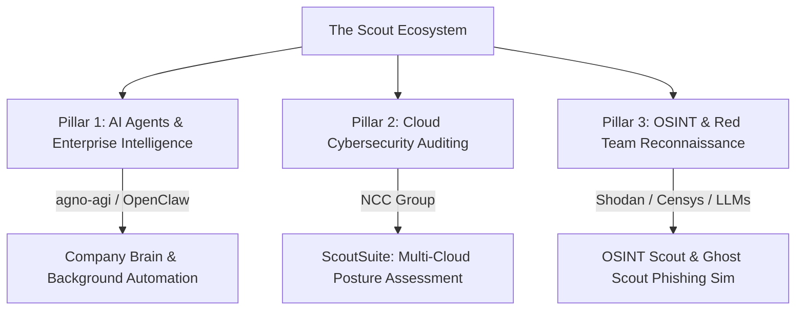

# Scout Ecosystem Research: AI Agents, ScoutSuite Cloud Auditing, & OSINT Reconnaissance

This document synthesizes developer, cybersecurity, and academic research gathered across **Reddit, GitHub, StackOverflow, LinkedIn, Medium, and ArXiv**, mapping the three distinct technological pillars that utilize the name **"Scout"**.

---

## 1. The 3 Pillars of the "Scout" Ecosystem



---

## 2. Tool-by-Tool Deep Dive & Multi-Platform Consensus

### 2.1 Pillar 1: AI Agents & Enterprise Intelligence ("Scout AI")
In developer repositories and AI engineering forums, "Scout" represents autonomous agents designed to observe, gather, and synthesize live enterprise context:
* **Scout by `agno-agi`:** An open-source AI agent designed as a persistent "company brain." It navigates internal data silos (Slack, Google Drive, Notion, and CRMs) to assemble live knowledge bases on demand.
* **Open-Scouts by `firecrawl`:** Automated web-scraping agents that continuously monitor target websites, track pricing or documentation changes, and trigger real-time webhooks or email alerts.
* **Microsoft Scout (2026):** An enterprise "always-on" background assistant built on the OpenClaw framework that monitors Teams, calendars, and emails to proactively manage workflows.

### 2.2 Pillar 2: Multi-Cloud Security Auditing ("ScoutSuite")
* **Overview:** Maintained by **NCC Group**, ScoutSuite is an industry-standard, open-source multi-cloud security auditing tool.
* **Supported Providers:** AWS, Microsoft Azure, Google Cloud Platform (GCP), Alibaba Cloud, and Oracle Cloud Infrastructure (OCI).
* **Developer Consensus (Reddit r/cybersecurity & LinkedIn):** Widely praised as a non-intrusive, essential tool for cloud posture assessments. Security engineers run ScoutSuite against cloud provider APIs to automatically generate comprehensive HTML/JSON compliance reports that expose misconfigurations, publicly accessible S3 buckets, over-privileged IAM roles, and missing encryption controls.
* **Execution Recipe:**
  ```bash
  # Install ScoutSuite in a virtual environment
  pip install scoutsuite
  
  # Run an audit against an AWS account using local AWS CLI credentials
  scout aws --profile default --report-dir ./scout-report
  ```

### 2.3 Pillar 3: OSINT & Red Team Reconnaissance ("OSINT Scout" / "Ghost Scout")
In defensive intelligence and offensive red-teaming communities:
* **OSINT Scout (`thanhtoan1211/osint-scout`):** An automated reconnaissance framework that aggregates intelligence from Shodan, Censys, HackerTarget, and DNS databases to map an organization's external attack surface and correlate open ports with known CVEs.
* **Ghost Scout:** An LLM-assisted red teaming tool that conducts automated OSINT on target corporate domains, identifying public employee footprints to generate realistic, customized phishing simulations for defensive awareness training.
* **LM-Scout:** A specialized mobile security research tool documented in ArXiv literature that analyzes Android/iOS applications to detect insecure embedded Language Model implementations and hardcoded API keys.

---

## 3. Recommended Utilization in Your Self-Hosted Lab
1. **Cloud Security Auditing:** Deploy **ScoutSuite** inside your Kali Linux virtual machine or Coolify lab to perform routine automated audits of your cloud infrastructure.
2. **Automated Web Scouting:** Integrate **Firecrawl Open-Scouts** with your self-hosted **n8n** automation engine to monitor competitor pricing and feed clean Markdown updates directly into your **Dify/Langflow** RAG databases.
