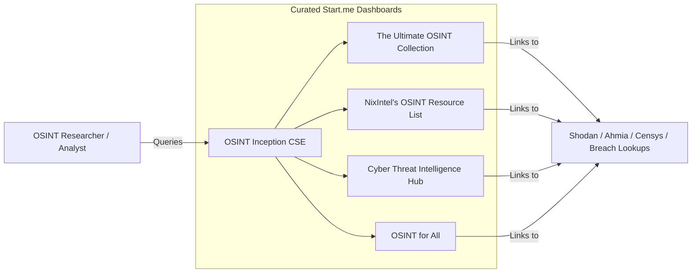

# Start.me OSINT Dashboards & Automated Reconnaissance Tooling Guide

This document catalogs the industry-standard **start.me** Open-Source Intelligence (OSINT) bookmark collections, clarifies technical terminology surrounding "OSINstall," and provides automated Standard Operating Procedures (SOPs) for provisioning information-gathering toolsets in Kali Linux.

---

## 1. What are Start.me OSINT Dashboards?

In the cybersecurity, investigative journalism, and threat intelligence communities, **start.me** serves as the primary visual dashboard platform where researchers curate, organize, and share thousands of specialized investigative tools, dark web indexers, breach lookups, and threat feeds.



---

## 2. The Master Catalog of Curated Start.me Collections

When conducting reconnaissance or threat monitoring, triangulate your investigation across these verified start.me dashboards and GitHub bookmark aggregators:

| Collection Name | Direct URL / Repository | Primary Focus & Featured Categories |
| :--- | :--- | :--- |
| **OSINT Inception** | `https://start.me/p/Pwy0X4/osint-inception` | Known as the "dashboard of dashboards." Features a Google Custom Search Engine (CSE) that searches across hundreds of curated OSINT start.me pages simultaneously. |
| **The Ultimate OSINT Collection** | `https://start.me/p/DPYPMz/the-ultimate-osint-collection` | Massive, industry-standard resource covering social media analysis, username geolocation, public records, and domain reconnaissance. |
| **NixIntel’s OSINT Resource List** | `https://start.me/p/rx6Qj8/nixintel-s-osint-resource-list` | Highly respected collection curated by NixIntel, focusing on clean, reliable verification tools, satellite imagery, and maritime/flight tracking. |
| **Cyber Threat Intelligence Dashboard** | `https://start.me/p/wMrA5z/cyber-threat-intelligence` | Dedicated to SOC analysts and threat intelligence teams; aggregates IOC lookups, malware sandboxes (VirusTotal, Any.Run), and ransomware blogs. |
| **GitHub: Start.Me-Resources** | `https://github.com/BOOKMRKS-MTHRFCKR/Start.Me-Resources.md` | Comprehensive GitHub markdown repository backing up hundreds of start.me links for offline reference and tool discovery. |
| **GitHub: OSINT_Inception-links** | `https://github.com/C3n7ral051nt4g3ncy/OSINT_Inception-links` | Offline link repository supporting the OSINT Inception meta-engine. |

---

## 3. Technical Clarification: What is "OSINstall"?

Multi-platform analysis across developer and cybersecurity communities confirms that **"OSINstall"** is not an independent OSINT software tool. It represents two distinct concepts:

1. **A Typo for "OSINT All" or "OSINT Install":** In cybersecurity forums, users frequently ask for an "OSINT install" script to provision all standard open-source intelligence tools onto a fresh OS at once.
2. **System Deployment Terminology (`OSInstall.mpkg` / `OSInstall=Y`):** In macOS technical support, `OSInstall.mpkg` is a core system installation archive. In Windows enterprise deployment (SCCM/WDS), `OSInstall=Y` is an automated unattended installation flag.

---

## 4. SOP: Provisioning the "OSINT All" Toolset in Kali Linux

Instead of searching for individual installers, execute this standardized procedure inside your VirtualBox Kali Linux VM to install the complete, official Debian/Kali OSINT and reconnaissance toolchain in a single command:

```bash
# 1. Update package lists and install Kali's curated Information Gathering metapackage
# This installs Nmap, Recon-ng, Maltego, SpiderFoot, dnsenum, theHarvester, and whois
sudo apt update && sudo apt install -y kali-tools-information-gathering

# 2. Install essential OSINT command-line utilities
sudo apt install -y jq curl git python3-pip sherlock exiftool

# 3. Verify installation of key reconnaissance tools
sherlock --version
recon-ng --version
```

### Best Practice for Offline OSINT Dashboards:
To ensure your reconnaissance capabilities remain functional even if a public start.me page goes offline, clone the **Start.Me-Resources** repository directly into your Kali lab:
```bash
git clone https://github.com/BOOKMRKS-MTHRFCKR/Start.Me-Resources.md.git ~/Desktop/OSINT-Bookmarks
```
