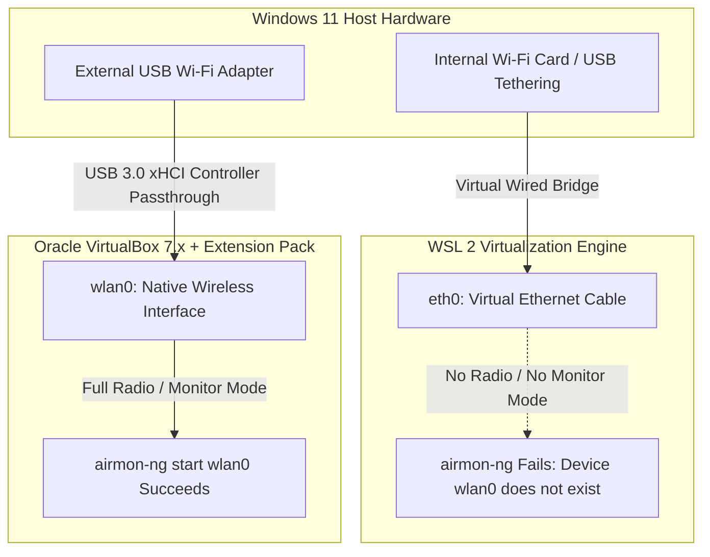

# VirtualBox Kali Linux & Antigravity CLI Lab Setup Guide

This document catalogs the architectural differences between WSL 2 and Oracle VirtualBox for wireless network auditing, provides solutions for virtual machine power-up conflicts, and defines the Standard Operating Procedure (SOP) for installing the **Antigravity CLI (`agy`)** inside a sandboxed Kali Linux environment.

---

## 1. Architectural Comparison: WSL 2 vs. VirtualBox for Wi-Fi Auditing

When attempting wireless network auditing (`airmon-ng`, WPA2 handshake capture) on a Windows host, the virtualization engine dictates how network hardware is presented to the Linux kernel:



> [!WARNING] Why `airmon-ng` Fails in WSL 2
> Windows shares your internet connection into WSL 2 as a virtual wired Ethernet cable (`eth0`). Because `eth0` is a simulated wired connection, Linux cannot access physical radio frequencies, rendering monitor mode impossible on internal Wi-Fi cards.

> [!TIP] The VirtualBox + Extension Pack Advantage
> By installing the **Oracle VirtualBox Extension Pack 7.x**, you unlock **USB 3.0 (xHCI) Controller Passthrough**. When you select an external USB Wi-Fi dongle in VirtualBox VM Settings ➔ USB, VirtualBox detaches the USB device from Windows and connects it directly to Kali Linux as **`wlan0`**, enabling 100% native monitor mode!

---

## 2. Troubleshooting: Solving "Powering Up VM..." Hangs

When booting a 64-bit Kali Linux VM in VirtualBox on Windows 11, the VM may occasionally hang or load slowly at the `"Powering up..."` stage.

### Root Cause: The Hyper-V / WSL 2 Resource Conflict
If you recently ran WSL 2 or Docker Desktop, Windows Hyper-V is actively running in the background and locking the CPU's hardware virtualization extensions (**Intel VT-x / AMD-V / SVM**). When VirtualBox attempts to power on a VM without VT-x access, it falls back to a slow Native Execution Engine (NEM), causing boot hangs.

### Remediation Protocol:
1. **Shutdown Active WSL 2 Instances:** Before starting Oracle VirtualBox, open Windows PowerShell and execute:
   ```powershell
   wsl --shutdown
   ```
2. **Verify Resource Allocation:** In VirtualBox Manager, open VM **Settings** ➔ **System** and ensure at least **2048 MB RAM** and **2 CPU Cores** are allocated to the Kali VM.

---

## 3. SOP: Installing Antigravity CLI (`agy`) in Kali Linux

Installing Antigravity CLI inside your Kali VirtualBox VM creates a sandboxed AI coding and cybersecurity lab where `agy` can directly analyze packet captures, review OSINT logs, and write automation scripts without endangering your host OS.

> [!WARNING] Why `npm install -g @google/antigravity-cli` Fails with 404
> Antigravity CLI is **not** published on the public npm registry (`npmjs.org`). Attempting to install it via npm results in an `E404 Not Found` error. AGY is a standalone native binary distributed via official Google Antigravity servers.

### Mandatory Installation Workflow (Linux / Kali x86_64):
Open your Kali Linux terminal and execute the official automated curl installer script:

```bash
# 1. Ensure curl and git are installed
sudo apt update && sudo apt install -y curl git

# 2. Download and run the official Antigravity CLI Linux installer
curl -fsSL https://antigravity.google/install.sh | bash

# 3. Verify installation and launch the CLI TUI
agy
```

### Authentication & Sandbox Execution:
When `agy` launches for the first time in your Kali terminal, it will output a one-time authentication URL. Open that link in your browser to complete login. Once authenticated, your AI assistant operates natively inside your virtual machine!

---

## 4. Related Knowledge Vault Links (Obsidian Graph)
Explore interconnected topics in your Knowledge Vault:
* [[Wireless_Network_Auditing_and_Aircrack_ng_Workflow]] — Handshake capture and defensive WPA2/WPA3 mitigations.
* [[Start_Me_OSINT_Dashboards_and_Automated_Tooling]] — Installing Kali OSINT metapackages and start.me bookmark collections.
* [[Reverse_Lookup_OSINT_Methodologies_and_Tools]] — Epieos, Sherlock, and reverse SSL recon workflows.
* [[Scout_AI_ScoutSuite_OSINT_Ecosystem_Research]] — Multi-cloud auditing via ScoutSuite in Kali.
* [[Candle_Ahmia_Haystack_Responsible_Research]] — Threat intelligence monitoring via Ahmia Tor search.
* [[Open_Source_AI_Stack_and_Agent_Ecosystem_Research]] — Connecting local Ollama and Coolify infrastructure.
