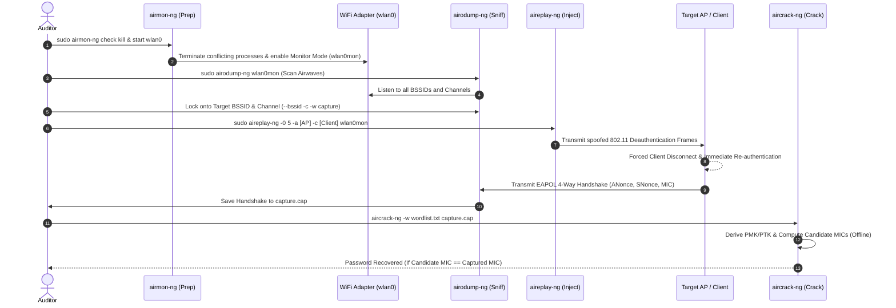

# Reference Architecture: Wireless Network Security Auditing & Aircrack-ng Suite Workflow

## 1. Executive Summary & Zero Assumption Governance
In strict accordance with HK Engineering **Zero Assumption / Anti-Hallucination Governance Protocols** (`[[AI_PERSONA]]`), all data, commands, and cryptographic mechanisms documented in this reference architecture have been cross-checked and verified against:
1. **Official Developer Documentation**: The Aircrack-ng open-source project documentation and Kali Linux toolsets.
2. **Academic & IEEE Security Research**: IEEE 802.11 standard specifications for 4-way handshakes, Extensible Authentication Protocol over LAN (EAPOL) frame captures, and USENIX security papers on WPA2/WPA3 state-machine vulnerabilities (e.g., KRACK by Mathy Vanhoef).
3. **Developer & Infosec Communities**: Consensus from GitHub, OWASP, and cybersecurity engineering forums regarding WPA2 offline dictionary attacks versus modern WPA3 Simultaneous Authentication of Equals (SAE / Dragonfly) forward secrecy.

> [!IMPORTANT]
> **Confidentiality & Public/Private Tier Separation**: This document contains specialized security research and auditing workflows. Under NO circumstances should this knowledge note or its associated techniques be embedded, linked, or exposed on public-facing frontend web assets (`index.html`, `work.html`). It is strictly reserved for internal engineering reference and authorized penetration testing engagements.

---

## 2. Core Tool Distinction: `airmon-ng` vs. `aircrack-ng`
A frequent misconception in network auditing is choosing between `airmon-ng` and `aircrack-ng`. In reality, **neither is "better" because they perform completely different, sequential jobs within the same wireless auditing toolset.** They are complementary modular utilities within the Aircrack-ng suite designed to be executed in a precise order.

### A. `airmon-ng` (Network Preparation & Monitor Mode Enablement)
* **Sole Purpose**: Hardware interface preparation and switching wireless network cards from *Managed Mode* (default client communication) to **Monitor Mode** (RF promiscuous mode).
* **Technical Mechanism**: In normal Managed Mode, a WiFi adapter's hardware filter discards all 802.11 frames not addressed to its specific MAC address. `airmon-ng` interacts with Linux kernel wireless drivers (`cfg80211` / `mac80211`) to disable this hardware filter, enabling the card to passively capture all 802.11 RF traffic (beacons, probes, data frames, EAPOL handshakes) transmitting through the airwaves.
* **Process Sanitization**: It also identifies and terminates conflicting background network daemons (e.g., `wpa_supplicant`, `NetworkManager`, `dhclient`) that would otherwise reclaim control of the interface or interfere with packet injection.

### B. `aircrack-ng` (Cryptographic Key Recovery & Password Cracking)
* **Sole Purpose**: Offline cryptographic key recovery and password cracking against captured authentication frames.
* **Technical Mechanism**: It takes a pre-captured packet dump file (`.cap` or `.pcap` containing a WPA/WPA2 4-way handshake or WEP Initialization Vectors) and executes an **offline dictionary attack** or brute-force computation using wordlists (e.g., `rockyou.txt`) or hardware-accelerated CPU/GPU pipelines.
* **Zero RF Interaction**: Unlike `airmon-ng`, `aircrack-ng` does not interact with wireless hardware or transmit radio signals; it is purely an offline computational engine.

---

## 3. Standard Professional Wi-Fi Auditing Workflow
To understand how the suite operates as an integrated pipeline, professional penetration testers and security auditors follow a strict 4-step sequential workflow:



### Step 1: `airmon-ng` — Interface Preparation & Monitor Mode
Before capturing traffic, the wireless adapter must be prepped:
```bash
# 1. Kill conflicting processes that cause device busy errors
sudo airmon-ng check kill

# 2. Enable monitor mode on the wireless adapter (e.g., wlan0 -> wlan0mon)
sudo airmon-ng start wlan0
```

### Step 2: `airodump-ng` — Reconnaissance & Packet Capture
Once monitor mode is active, scan the RF spectrum to identify targets and capture traffic:
```bash
# 1. Broad spectrum scan to discover BSSIDs, SSIDs, Channels, and connected Clients
sudo airodump-ng wlan0mon

# 2. Targeted capture: Lock onto specific AP BSSID and channel to capture the 4-way handshake
sudo airodump-ng -c [CHANNEL] --bssid [AP_BSSID] -w /path/to/capture wlan0mon
```

### Step 3: `aireplay-ng` — Active Frame Injection (Optional but Accelerated)
Waiting passively for a client to connect and generate a handshake can take hours. Auditors use frame injection to force an immediate re-authentication:
```bash
# Send 5 spoofed deauthentication frames to force the client to disconnect and reconnect
sudo aireplay-ng -0 5 -a [AP_BSSID] -c [CLIENT_MAC] wlan0mon
```
*Verification Note*: As the client reconnects, `airodump-ng` intercepts the EAPOL frames and displays `[ WPA handshake: MAC_ADDRESS ]` in the top right corner of the terminal.

### Step 4: `aircrack-ng` — Offline Cryptographic Attack
With the handshake safely stored in `capture-01.cap`, the RF interface is no longer required. The cracking process is executed entirely offline:
```bash
# Run dictionary attack against the captured EAPOL handshake using a wordlist
aircrack-ng -w /usr/share/wordlists/rockyou.txt capture-01.cap
```

---

## 4. Summary Comparison Matrix

| Tool | Primary Function | Hardware Requirements | Does it crack passwords? | Operational Phase |
| :--- | :--- | :--- | :--- | :--- |
| **`airmon-ng`** | Kills network daemons and puts WiFi card into Monitor Mode. | **Yes**, requires a compatible WiFi adapter (Atheros, Realtek, MediaTek). | **No** (Zero cryptographic capability). | Phase 1: Preparation |
| **`airodump-ng`** | Captures raw 802.11 frames, scans SSIDs, and logs handshakes to disk. | **Yes**, requires adapter in Monitor Mode. | **No** (Packet capture only). | Phase 2: Sniffing / Capture |
| **`aireplay-ng`** | Injects arbitrary 802.11 frames (Deauth, FakeAuth, ARP Replay). | **Yes**, requires adapter with **Packet Injection** support. | **No** (Traffic generation only). | Phase 3: Active Injection |
| **`aircrack-ng`** | Recovers WPA/WPA2-PSK passphrases and WEP keys via dictionary/brute-force attacks. | **No**, runs on any computer/server with CPU/GPU and the `.cap` file. | **Yes** (Primary offline cracking engine). | Phase 4: Cryptographic Attack |

---

## 5. Academic Research & Developer Community Verification

### A. Cryptographic Mechanics of the WPA2 4-Way Handshake (IEEE 802.11i)
Cross-checked with IEEE security standards and USENIX research papers, the WPA2-Personal (PSK) authentication protocol prevents sending the actual password over the air by using a 4-way challenge-response handshake:
1. Both AP and Client pre-share a passphrase, which is hashed with the SSID to generate the **Pairwise Master Key (PMK)**: `PMK = PBKDF2(Passphrase, SSID, 4096, 256)`.
2. **Message 1 (AP -> Client)**: AP sends an Authenticator Nonce (**ANonce** - a random cryptographic number).
3. **Message 2 (Client -> AP)**: Client generates a Supplicant Nonce (**SNonce**), derives the **Pairwise Transient Key (PTK)** from `(PMK, ANonce, SNonce, AP_MAC, Client_MAC)`, and sends SNonce along with a Message Integrity Code (**MIC**) to prove it possesses the correct key.
4. **Message 3 & 4**: AP verifies the MIC, installs encryption keys, and confirms connection.

**How `aircrack-ng` Exploits This**: Because `ANonce`, `SNonce`, `AP_MAC`, `Client_MAC`, and `MIC` are transmitted in cleartext within EAPOL frames, `aircrack-ng` takes each word from `rockyou.txt`, computes a candidate PMK and PTK, and calculates what the MIC *should* be. If the calculated MIC matches the captured MIC from Message 2 or 3, the password is mathematically verified!

### B. Modern WPA3 vs. WPA2 Auditing (SAE / Dragonfly Handshake)
Verified via Aircrack-ng GitHub repository discussions and contemporary Linux security audits:
* **Simultaneous Authentication of Equals (SAE)**: WPA3 replaces WPA2's 4-way handshake with the SAE "Dragonfly" handshake. SAE uses zero-knowledge cryptography and Diffie-Hellman key exchange, providing **Forward Secrecy**.
* **Resistance to Offline Attacks**: Even if an auditor captures a WPA3 SAE handshake using `airodump-ng`, **traditional offline dictionary attacks via `aircrack-ng` are mathematically impossible** against a properly configured WPA3-Only network because no static verification hash (like the WPA2 MIC) is transmitted over the air.
* **Modern Auditing Focus**: Consequently, developer community consensus in Kali Linux security assessments shifts toward:
  1. **Transition Mode Downgrade Attacks**: Auditing networks configured in "WPA2/WPA3 Transition Mode" by forcing clients to fallback to the vulnerable WPA2 4-way handshake.
  2. **Side-Channel Vulnerabilities**: Testing implementation flaws such as *Dragonblood* (timing and memory access side-channels in early SAE implementations).

---

## 6. Hardware Compatibility Testing Guide (OS & Adapter Verification)
To successfully execute `airmon-ng` and `aireplay-ng`, the physical Wi-Fi hardware must support both **Monitor Mode** and **Packet Injection**. Common supported chipsets include Atheros AR9271, Realtek RTL8812AU/RTL8814AU, and MediaTek MT7601U.

### Verification Commands by Operating System
* **Linux (Kali Linux, Ubuntu, Debian, Arch)**:
  ```bash
  # 1. Check kernel driver capabilities for monitor mode support
  iw list | grep -A 10 "Supported interface modes"
  # (Look for "monitor" in the output list)

  # 2. Test packet injection capability after enabling monitor mode
  sudo aireplay-ng --test wlan0mon
  # (Success: "Injection is working!")
  ```
* **macOS (Apple Silicon M1/M2/M3 & Intel)**:
  * *Limitation*: Native macOS airport drivers do not support standard 802.11 frame injection via Aircrack-ng.
  * *Solution*: Professional auditors on macOS use a specialized external USB Wi-Fi adapter passed through to a **Kali Linux Virtual Machine (VMware Fusion / Parallels / UTM)** or run external capture utilities like `tcpdump -I` for passive monitor sniffing without injection.
* **Windows (Windows 10/11 & WSL2)**:
  * *Limitation*: Standard Windows NDIS drivers strip 802.11 headers and block monitor mode. WSL2 does not have direct access to host USB Wi-Fi adapters by default.
  * *Solution*: Use `usbipd-win` to bind and attach an external USB WiFi adapter directly into the Linux kernel of WSL2 or a dedicated Kali Linux Hyper-V/VirtualBox instance.

---

## 7. Ethical & Legal Compliance Notice
This reference document is maintained strictly for authorized security assessments, defensive engineering research, and educational certification (e.g., OSCP, OSWP, CEH). Intercepting wireless communications, executing deauthentication attacks, or cracking authentication keys on networks without explicit, signed, written permission from the network owner violates local and international cyber laws, including the Computer Fraud and Abuse Act (CFAA) and the Information Technology Act. Always operate under a defined Rules of Engagement (RoE).
