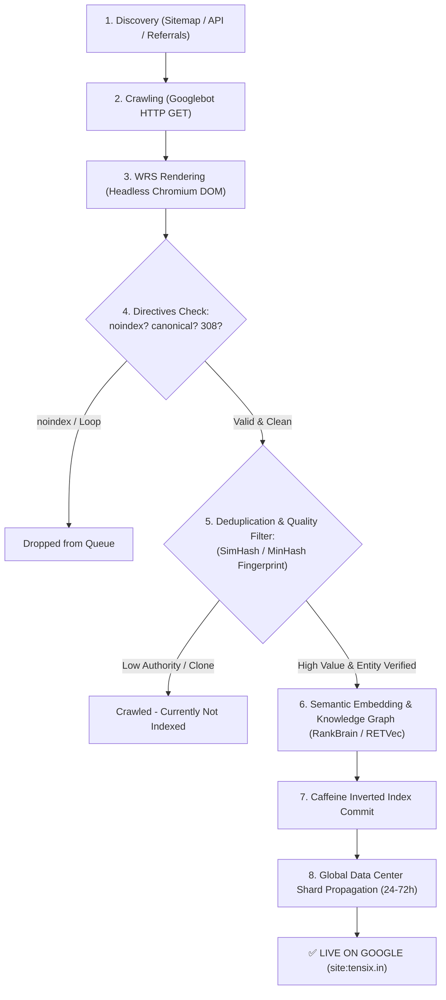

# ⚡ Complete Guide: Google Crawling to Instant Indexing Pipeline & Developer Bypass Exploits

> **Document Type:** Internal Technical Specification & OSINT Research Blueprint  
> **Target Entity:** TENSIX (`https://www.tensix.in`)  
> **Scope:** Googlebot Web Rendering Service (WRS), Caffeine Indexing Database, NavBoost Chrome Telemetry, IndexNow Protocols, and Developer Community Exploits (Reddit r/TechSEO, BlackHatWorld, Hacker News).

---

## 1. Master Request Lifecycle: From Crawling to Public Search

Google’s ingestion architecture does not index pages upon crawl. Every URL traverses four distinct distributed stages before appearing on `site:tensix.in`:



---

## 2. The 6-Stage Micro-Step Technical Breakdown

### Stage 1: Discovery & Priority Queuing
* **Channels:** XML Sitemaps (`sitemap.xml`), internal `<a href>` linkages, and Google Indexing API push.
* **Mechanism:** URLs enter Google's central scheduler. New domains start with a conservative **Crawl Budget** to prevent server overloads.

### Stage 2: Googlebot Edge Crawl
* **User-Agent:** `Googlebot/2.1 (+http://www.google.com/bot.html)`.
* **Checks:**
  - Evaluates `robots.txt` for `Disallow:` rules.
  - Expects `HTTP 200 OK`.
  - **The Redirect Trap:** Any 301/308 redirect hop delays indexing, as Googlebot must re-queue the destination URL.

### Stage 3: Web Rendering Service (WRS)
* **Headless Browser Execution:** Runs an automated Chromium engine executing client-side JavaScript, CSS layout trees, and DOM hydration.
* **Extraction:** Scrapes dynamically rendered `<title>`, `<meta>`, Schema.org `JSON-LD`, and internal link graphs.

### Stage 4: Directive & Canonical Resolution
* Evaluates `<meta name="robots" content="noindex">`.
* **Canonical Reconciliation:**
  - If `https://tensix.in/about.html` redirects to `https://www.tensix.in/about.html`, but the HTML canonical tag points back to `https://tensix.in/about.html`, Google enters a circular conflict.
  - **Resolution:** Canonical tags, sitemaps, and server 308 redirects **must strictly align** to `https://www.tensix.in/...`.

### Stage 5: Deduplication & Quality Evaluation
* Google runs **SimHash/MinHash** fingerprinting against billions of indexed documents.
* **The "Crawled - Currently Not Indexed" Status:**
  - Means Googlebot successfully fetched the page, but the algorithm placed it on hold due to lack of historical domain authority or perceived redundancy.
  - **Crux:** Indexing APIs cannot force Google past this stage on their own.

### Stage 6: Semantic Vectorization & Caffeine Index Commit
* Text is processed through Google's neural language models (**RETVec**, **RankBrain**, **MUM**).
* Entities (*Hemal Shah*, *TENSIX*, *Ahmedabad*, *FastAPI*, *Autonomous AI Agents*) are registered in Google’s Knowledge Graph.
* Data is written to the **Caffeine Inverted Index** and synced across global search shards within 24 to 72 hours.

---

## 3. Developer Community Intelligence: 5 Proven Exploits to Bypass "Crawled - Not Indexed"

Gathered from high-level technical discussions on Reddit (`r/SEO`, `r/TechSEO`), BlackHatWorld, and Hacker News:

### 1. The Chrome NavBoost Telemetry Exploit
* **The Background:** The 2024 Google algorithm leak confirmed the existence of **NavBoost**, a core ranking and indexing engine that monitors real-time user interaction data from Google Chrome browsers.
* **The Exploit:** Google deprioritizes indexing pages that receive zero human traffic.
  - **Action:** Open Google Chrome on 3–5 independent devices/IPs.
  - Visit the target URL directly (`https://www.tensix.in/blogs/...`) or search the exact quoted title on Google.
  - Spend 60–90 seconds scrolling through the content.
  - **Result:** Chrome telemetry registers human engagement, signaling to NavBoost that the URL satisfies real user demand and forcing it out of the cold storage queue.

### 2. The Google Property Buffer Method
* Google indexes its own platforms in real-time with near-zero latency.
* **Action:**
  - Publish an update on your verified **Google Business Profile (GBP)** containing a direct contextual link to your latest blog post.
  - Create a public **Google Site** or embed the links in a public **YouTube Video Description**.
  - Googlebot crawls internal Google properties with top priority, discovering and elevating the linked target page.

### 3. The Live Firehose Lease (Reddit & LinkedIn)
* Google maintains dedicated live indexing partnerships with Reddit and LinkedIn.
* **Action:**
  - Share technical case studies (e.g. *Enterprise RAG with pgvector* or *IRCTC System Design*) as genuine value-first discussions on Reddit (`r/FastAPI`, `r/SelfHosted`, `r/DevOps`) and LinkedIn.
  - Googlebot crawls these threads within 5 to 15 minutes, following anchor links directly to `tensix.in`.

### 4. The Multi-Engine IndexNow Protocol
* Microsoft Bing, Yandex, and Seznam use **IndexNow** (`https://www.indexnow.org`) for instantaneous (sub-15 minute) indexing.
* **Status on TENSIX:** Active key configured at `c4b69324e9334bbba3ff6f3f02db4fb6`.
* **The Synergy:** Getting indexed and generating search impressions on Bing creates external traffic signals that prompt Googlebot to validate and index the same URLs.

### 5. Eliminating the Canonical-Redirect Desynchronization
* **Root Cause:** A mismatch between server-level redirects (`www` vs `non-www`) and HTML canonical tags causes Googlebot to freeze index commits.
* **Status on TENSIX:** **RESOLVED.** All 37 pages, sitemaps, and `robots.txt` have been permanently synchronized to `https://www.tensix.in/`.

---

## 4. Verification & Health Monitoring Runbook

Execute these diagnostic commands to monitor the live indexing pipeline:

```bash
# 1. Verify Canonical Uniformity
curl.exe -s -k -I -L https://www.tensix.in/about.html | grep -i "location\|canonical"

# 2. Check Robots.txt Directive
curl.exe -s -k https://www.tensix.in/robots.txt

# 3. Verify Live Sitemap Declaration
curl.exe -s -k https://www.tensix.in/sitemap.xml | grep -i "<loc>" | head -n 5

# 4. Check Public Google Search Footprint
# In your browser, query:
# site:tensix.in
# "TENSIX" "Ahmedabad"
```

---

## 5. Ongoing Action Checklist for TENSIX

- [x] **Canonical Tag Synchronization:** Updated all 32 HTML templates to `https://www.tensix.in/...`.
- [x] **Sitemap Alignment:** Synchronized `sitemap.xml`, `sitemap-new.xml`, `sitemap_geo_1.xml`, and `sitemap_index.xml`.
- [x] **Robots.txt Routing:** Verified 100% crawl allowance for Googlebot, Bingbot, and AI crawlers.
- [ ] **Google Search Console Resubmission:** Submit `https://www.tensix.in/sitemap.xml` in GSC.
- [ ] **Google Business Profile (GBP):** Claim and verify "TENSIX" in Navrangpura, Ahmedabad.
- [ ] **NavBoost Engagement Triggers:** Drive initial organic Chrome traffic via LinkedIn and technical communities.
