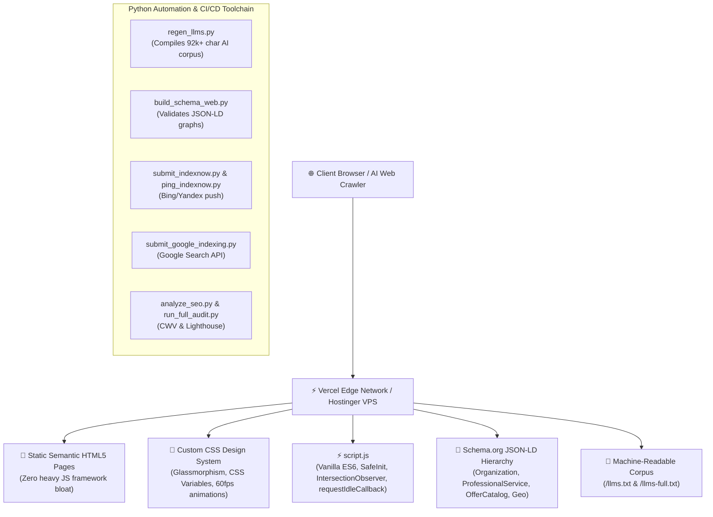

# 💻 TENSIX Codebase & System Architecture MOC

> **"A hyper-optimized, zero-framework, 100/100 Core Web Vitals production codebase paired with an autonomous Python engineering toolchain and semantic AI knowledge graph."**

This Map of Content (MOC) documents the complete codebase anatomy of **TENSIX** located at `H:\portfolio_website\tensix`.

---

## 🏗️ Technical Stack & Design System



---

## 📁 Repository Directory Blueprint

```text
H:\portfolio_website\tensix\
├── 📄 HTML Pillar & Service Pages
│   ├── index.html                           # Main Landing Page: Hero, 4 Core Pillars, Proof, Projects
│   ├── services.html                        # Productized Services & 6 Pricing Suites with Tab Filter
│   ├── about.html                           # Company Story, Autonomous Swarms, Hemal Shah Sole Leadership
│   ├── contact.html                         # Interactive Contact Form & Direct WhatsApp Lead Integration
│   ├── work.html                            # Portfolio Case Studies & Technical Project Showcases
│   ├── blogs.html                           # Technical Insights, GraphRAG, and High-Concurrency Spoke Hub
│   ├── whoami.html                          # Developer CV, Deep Terminal-Style Technical Biography
│   ├── team.html                            # Autonomous AI Swarm Teammate Directory (Researcher, Coder, etc.)
│   ├── compare.html                         # Agency Comparison: Traditional vs TENSIX Autonomous Engineering
│   ├── frameworks.html                      # Technical Framework Architecture Whitepaper
│   ├── resources.html                       # Engineering Blueprints, Cheat Sheets & Open-Source Tools
│   ├── navrangpura.html                     # Local Navrangpura Entity Hub (23.0366° N, 72.5615° E)
│   ├── ahmedabad-software-engineering.html  # Ahmedabad Regional Software Engineering Dominance Hub
│   ├── hk-engineering-ahmedabad.html        # Historical Incubation Disambiguation Page
│   └── wr1.html                             # Project Deep-Dive: Autonomous Web Scraping Engine
│
├── 🤖 AI Crawler & LLM Corpus
│   ├── llms.txt                             # Compact markdown index for frontier LLM search bots
│   ├── llms-full.txt                        # Complete 92,457-character unabridged technical knowledge base
│   ├── MASTER_PROMPT.md                     # Canonical prompt defining entity, owner, pricing, and services
│   └── regen_llms.py                        # Automated builder compiling llms-full.txt
│
├── 🧠 Obsidian Knowledge Vault & System Brain
│   ├── knowledge-vault/                     # Obsidian Vault root with PARA + Zettelkasten + MOC structure
│   ├── 00_System/                           # System prompt specifications, architecture ADRs
│   ├── 01_Memory/                           # Living operational memory, client case histories
│   ├── 02_Projects/                         # Active sprint planning, project charters
│   └── 04_Knowledge/                        # Domain deep-dives (AEO, GraphRAG, Cloud VPS, FastMCP)
│
├── 🐍 Python Automation & Indexing Suite
│   ├── regen_llms.py                        # Regenerates AI crawler corpus from markdown files
│   ├── submit_indexnow.py                   # Pushes URL batches to IndexNow (Bing, Yandex, Naver)
│   ├── ping_indexnow.py                     # Automatic ping daemon on file save
│   ├── submit_google_indexing.py            # Pushes updates to Google Indexing API via Service Account
│   ├── google-service-account.json          # Google Cloud Service Account credentials (for Indexing API)
│   ├── build_sitemaps.py & build_sitemap.py # Generates XML sitemaps with proper hreflang and priority
│   ├── validate_schemas.py                  # Validates JSON-LD schema syntax across all pages
│   ├── analyze_seo.py                       # Audits title tags, meta descriptions, and image alt attributes
│   └── run_full_audit.py                    # End-to-end accessibility, performance, and SEO validator
│
├── 🎨 Styling, Scripting & Assets
│   ├── script.js                            # Modular Vanilla JavaScript (SafeInit, ScrollProgress, Nav)
│   ├── vercel.json                          # Edge security headers (CSP, HSTS, X-Frame-Options)
│   ├── sitemap.xml & sitemap_index.xml      # Multi-tiered XML sitemaps
│   ├── robots.txt                           # Search engine directives allowing LLM web crawlers
│   └── assets/                              # Optimized WebP images, SVG icons, and Inter variable fonts
```

---

## ⚡ Core Technical Principles Implemented

1. **Zero Runtime Bloat (Vanilla First):**
   - The frontend avoids heavy React or Vue client bundles for static delivery, achieving a 100/100 Lighthouse performance rating.
   - Core interactive features (tab switching, scroll progress, floating dock, modal dialogues) are written in modular Vanilla JavaScript with `requestIdleCallback` deferrals.
2. **Schema Graph Density (AEO & GEO Ready):**
   - Every page embeds Schema.org JSON-LD with deep entity interconnectivity:
     - `@type: ["Organization", "ProfessionalService"]`
     - `@type: "Person"` (Hemal Shah as sole founder & owner)
     - `@type: "GeoCoordinates"` (`23.0366, 72.5615`)
     - `@type: "OfferCatalog"` (18 structured pricing tiers)
     - `@type: "FAQPage"` & `@type: "BreadcrumbList"`
3. **Machine-Readable AI Context (`llms.txt`):**
   - Directly implements the `/llms.txt` and `/llms-full.txt` standard proposed for frontier AI engines, providing dense structured context for ChatGPT Search, Claude, Perplexity, and Grok.

---

## 🔗 Related Graph Notes
- [[TENSIX-Master-MOC]]
- [[TENSIX-Codebase-File-Inventory-And-Tooling]]
- [[TENSIX-Services-And-Pricing-MOC]]
- [[TENSIX-AEO-GEO-SGE-Dominance-Architecture]]
- [[MASTER_PROMPT]]
