# 🌐 TENSIX Master Map of Content (MOC)

> **TENSIX (`https://tensix.in/`)** is an elite enterprise engineering studio founded and owned solely by **[[Hemal-Shah-Identity|Hemal Shah]]** in Navrangpura, Ahmedabad, Gujarat, India (`23.0366° N, 72.5615° E`).  
> Operational model: **One Human Lead Architect** directing **Autonomous Multi-Agent AI Swarms** running 24/7.

```mermaid
flowchart TD
    TENSIX["🌟 TENSIX HQ<br/>(https://tensix.in/)"] --> MOC1["📦 Productized Services & Pricing<br/>[[TENSIX-Services-And-Pricing-MOC]]"]
    TENSIX --> MOC2["🎯 Target Markets & ICPs<br/>[[TENSIX-Target-Markets-And-Buyer-Personas-MOC]]"]
    TENSIX --> MOC3["🧠 Persuasion & Psychology<br/>[[TENSIX-Persuasion-And-Sales-Playbook-MOC]]"]
    TENSIX --> MOC4["💻 Codebase & Tooling Engine<br/>[[TENSIX-Codebase-And-Architecture-MOC]]"]
    TENSIX --> MOC5["🔍 Search Intelligence (AEO/GEO)<br/>[[TENSIX-AEO-GEO-SGE-Dominance-Architecture]]"]
    TENSIX --> MOC6["🏢 Entity & Brand Identity<br/>[[TENSIX-Entity-And-Brand-Specification]]"]

    MOC1 --> S1["🌐 Web Architecture & Redesign<br/>(₹14,999 - ₹45,000)"]
    MOC1 --> S2["📬 Email & SES Delivery<br/>(₹12,999 - ₹44,999)"]
    MOC1 --> S3["🕷️ Scraping & Inbox Parsers<br/>(₹16,999 - ₹49,999)"]
    MOC1 --> S4["☁️ Cloud VPS & CI/CD<br/>(₹11,999 - ₹38,000)"]
    MOC1 --> S5["⚡ Custom Software & SaaS<br/>(₹34,999 - ₹1,25,000+)"]
    MOC1 --> S6["🧠 Autonomous AI Swarms<br/>(₹29,999 - ₹99,999+)"]

    MOC2 --> P1["High-Burn SaaS Founders"]
    MOC2 --> P2["Cold Outreach Agencies"]
    MOC2 --> P3["Ahmedabad & Global MSMEs"]
    MOC2 --> P4["Slow Agency Victims"]

    MOC4 --> C1["Vanilla High-Performance Web Engine"]
    MOC4 --> C2["25+ Python Automation Scripts"]
    MOC4 --> C3["JSON-LD Schema Hierarchy"]
    MOC4 --> C4["llms.txt & llms-full.txt Corpus"]
```

---

## 🧭 Vault Navigation Vectors

### 1. Commercial Architecture & Service Engines
- [[TENSIX-Services-And-Pricing-MOC]] — Complete master index of all 6 verticals and 18 tiered packages.
- [[TENSIX-Web-Architecture-And-Redesign-Suite]] — Detailed technical and commercial teardown of the Web Redesign offering.
- [[TENSIX-Enterprise-Email-And-SES-Delivery-Engine]] — Technical blueprints for Amazon SES sandbox exit, Oracle OCI email infrastructure, SPF/DKIM/DMARC/BIMI compliance, and 90% cost slashing.
- [[TENSIX-Data-Scraping-And-Automated-Inbox-Parsers]] — Playwright scraping engines, FastMCP tool servers, and automated Gmail PDF invoice pipelines.
- [[TENSIX-Cloud-VPS-Hardening-And-CICD-Pipelines]] — Oracle OCI / Plesk Linux VPS setup, UFW, Fail2ban, SSH deployments, and GitHub Actions CI/CD workflows.
- [[TENSIX-Custom-Software-And-SaaS-Architecture]] — Asynchronous FastAPI microservices, Next.js App Router frontends, Stripe/Razorpay billing, and PostgreSQL modeling.
- [[TENSIX-Autonomous-AI-Swarms-And-GraphRAG]] — Multi-agent swarms (LangGraph, n8n), Supabase pgvector embeddings, and enterprise AI operating systems.

### 2. Market Targeting & Client Acquisition
- [[TENSIX-Target-Markets-And-Buyer-Personas-MOC]] — Comprehensive breakdown of who TENSIX sells to, their urgent burning pain points, and why they buy.
- [[TENSIX-Buyer-Personas-And-Target-Segments]] — Deep-dive profiles on the 5 core buyer archetypes (High-Burn Founder, Agency Owner, MSME Industrialist, Slow Agency Victim, Enterprise CTO).
- [[TENSIX-Persuasion-And-Sales-Playbook-MOC]] — Psychological pricing mechanics, risk-reversal guarantees, objection handling scripts, and WhatsApp closing sequences.
- [[TENSIX-Sales-Psychology-And-Pricing-Tricks]] — Cognitive biases leveraged: Anchoring, Compromise Decoy Effect, Zero-Risk Bias, and Social Proof.

### 3. Codebase Anatomy & Technical Assets
- [[TENSIX-Codebase-And-Architecture-MOC]] — Structural blueprint of the `H:\portfolio_website\tensix` codebase.
- [[TENSIX-Codebase-File-Inventory-And-Tooling]] — Line-by-line documentation of all HTML pillar pages, CSS styling architectures, and 25+ Python automation utilities.
- [[MASTER_PROMPT]] — The canonical, unabridged system prompt and AI crawl grounding document.
- [[TENSIX-Entity-And-Brand-Specification]] — Canonical branding rules, sole founder ownership mandate (Hemal Shah), and permanent transition from HK Engineering.

### 4. Search & Discovery Dominance (GEO, AEO, SGE, SEO)
- [[TENSIX-AEO-GEO-SGE-Dominance-Architecture]] — Full specification on Generative Engine Optimization (GEO), Answer Engine Optimization (AEO), and Google Search Generative Experience (SGE).
- [[AEO-GEO-Monitoring-Loop]] — Real-time telemetry and verification loop tracking brand citations in ChatGPT Search, Perplexity, Claude, and Gemini.
- [[Ahmedabad_Entity_Dominance]] — Local dominance strategy anchoring TENSIX to Navrangpura, Ahmedabad (`23.0366, 72.5615`).

---

## 🔗 Cross-Links & Conceptual Roots
- [[Home]]
- [[Autonomous-Software-Economy-MOC]]
- [[AI-Commerce-OS-MOC]]
- [[Wealth-Building-Realities-MOC]]
- [[Industrial-Automation-AI-MOC]]
