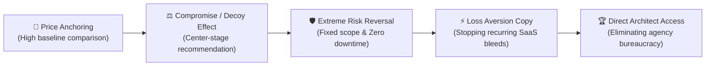
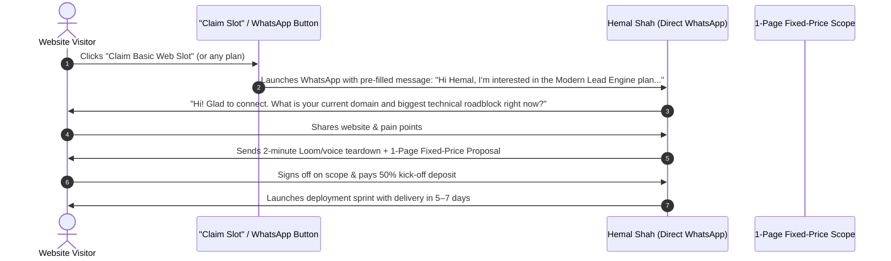

# 🧠 TENSIX Persuasion, Psychology & Sales Playbook MOC

> **"Clients do not buy code, frameworks, or databases. Clients buy time saved, costs slashed, risk eliminated, and predictable business outcomes."**

This Map of Content (MOC) dissects the **behavioral psychology, pricing architecture, objection handling scripts, and lead conversion frameworks** implemented across [[TENSIX-Services-And-Pricing-MOC|TENSIX Commercial Offerings]].

---

## 🎭 The 5 Core Cognitive Biases Leveraged

### 1. Price Anchoring (Asymmetric Value Comparison)
- **Principle:** Prospects cannot evaluate a standalone number without a reference point. If a prospect sees ₹24,999 with no context, they wonder if it is expensive.
- **TENSIX Implementation:** Every pricing card features an explicit comparison anchor:
  - *"Saves ₹35,000 vs bloated traditional agencies"*
  - *"Replaces a ₹60,000/mo manual data entry assistant"*
  - *"Cuts Mailchimp fees by 90% (saving ₹15,000+/month permanently)"*
- **Outcome:** The client feels they are profiting immediately from day one.

### 2. The Center-Stage / Compromise Decoy Effect
- **Principle:** In a 3-tier structure, human psychology naturally rejects the cheapest option (fear of low quality) and hesitates at the highest option (fear of overpaying), gravitating toward the middle option.
- **TENSIX Implementation:**
  - Middle tiers are visually elevated with `border: 2px solid rgba(59, 130, 246, 0.8)`, an eye-catching gradient glow, and a glowing highlight badge (`Most Popular` / `Best Value`).
  - Tier 1 exists as a high-friction or low-scope anchor; Tier 3 exists as an enterprise ceiling anchor.

### 3. Radical Risk Reversal (The 4 Pillars)
- **Principle:** The number one reason B2B clients fail to sign deals is **fear of catastrophic failure** (server downtime, lost Google rankings, being scammed or ghosted).
- **TENSIX Implementation:**
  - **100% Fixed-Price Scope:** No runaway hourly billing or surprise invoices.
  - **Zero-Downtime Guarantee:** Safe migrations with zero customer disruption.
  - **Complete IP & Credential Ownership:** Full root credentials and code transferred from Day 1.
  - **Direct Architect Access:** Client works with Hemal Shah directly, eliminating junior account executive friction.

### 4. Loss Aversion Over Feature Promotion
- **Principle:** Humans are twice as motivated to prevent losing $1,000 as they are to gain $1,000.
- **TENSIX Implementation:** Copy focuses on stopping active financial bleeds:
  - *"Are you paying Mailchimp $500/mo for basic emails?"*
  - *"Are your emails landing in the spam folder?"*
  - *"Is your slow WordPress website losing 40% of mobile visitors before they even read your headline?"*

---

## 💬 Objection Handling Scripts

### Objection 1: "Why should I pay ₹24,999 when a freelancer on Fiverr will build a site for ₹5,000?"
> **The Script:**  
> *"You can certainly hire someone on Fiverr for ₹5,000. But that ₹5,000 buys you a bloated WordPress template that takes 6 seconds to load, fails on mobile, breaks on plugin updates, and leaves your database open to vulnerabilities. At TENSIX, you don't buy a template; you invest in a production-grade lead engine built with clean code, 95+ mobile PageSpeed scores, automated database lead capture, and complete on-page SEO schema. If one qualified client contacts you through our fast mobile interface instead of bouncing off a slow template, your investment is already paid back."*

### Objection 2: "Why shouldn't I hire a traditional digital agency?"
> **The Script:**  
> *"Traditional agencies charge ₹1,00,000+ because they have account executives, project managers, office leases, and layers of bureaucracy. The person actually writing your code is often an unpaid junior intern. At TENSIX, you work directly with Lead Architect Hemal Shah. By deploying autonomous AI swarms to handle boilerplate and testing, I deliver enterprise-grade architecture in 7–10 days at 30% of the cost of a traditional agency, with zero communication middlemen."*

### Objection 3: "Is Amazon SES or Oracle Cloud really better than Mailchimp?"
> **The Script:**  
> *"Mailchimp charges you exponentially as your email list grows—often $300 to $1,000+ every month just to store emails. Amazon SES charges $0.10 for every 1,000 emails sent, and Oracle Cloud includes generous dedicated delivery bandwidth. By engineering custom SPF, DKIM, DMARC, and BIMI records on dedicated infrastructure, you achieve 99.5% inbox delivery and slash your monthly software bill by 90% forever."*

---

## 📲 WhatsApp Lead Conversion Flow

---

## 🔗 Related Graph Notes
- [[TENSIX-Master-MOC]]
- [[TENSIX-Services-And-Pricing-MOC]]
- [[TENSIX-Target-Markets-And-Buyer-Personas-MOC]]
- [[TENSIX-Sales-Psychology-And-Pricing-Tricks]]
- [[MASTER_PROMPT]]
