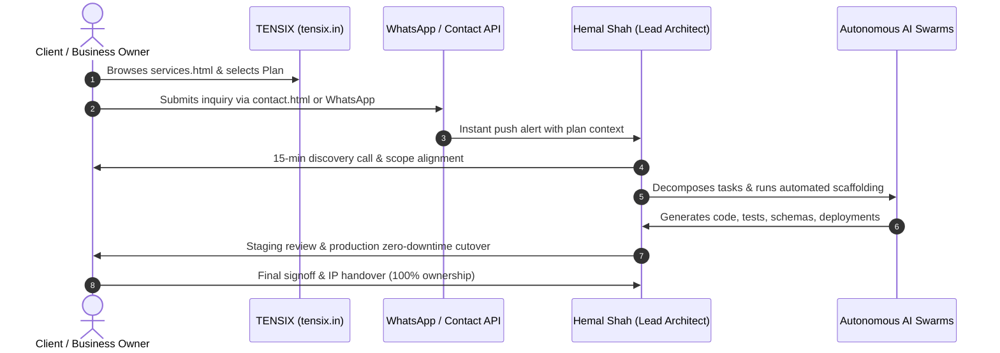

# 📦 TENSIX Productized Services & Commercial Pricing Matrix

> **"No bloated agency overhead. No surprise hourly invoices. Complete, production-grade systems engineered directly by Lead Architect Hemal Shah with 100% intellectual property ownership from Day 1."**

This Map of Content (MOC) indexes all **6 core productized engineering suites** and **18 structured tiers** deployed on [[services.html|TENSIX Services Page]], backed by psychological price anchoring and guaranteed turnaround times.

---

## 📊 Comprehensive Commercial Pricing Matrix

| Category / Vertical | Tier 1 (Entry / Fix) | Tier 2 (Flagship / Best Value) ⭐ | Tier 3 (Enterprise Scaler) |
| :--- | :--- | :--- | :--- |
| **🌐 Web Architecture & Redesign** [[TENSIX-Web-Architecture-And-Redesign-Suite]] | **Basic Web Architecture** • Investment: **₹14,999** • Turnaround: 5–7 Days • 6–10 pages, mobile responsive, Hostinger | **Modern Lead Engine** ⭐ • Investment: **₹24,999** • Turnaround: 7–10 Days • 15+ pages, React/Next.js, lead capture DB, 95+ PageSpeed | **Complete Digital Platform** • Investment: **₹45,000** • Turnaround: 14–18 Days • Next.js App Router, admin CMS, full AI Search schema |
| **📬 Enterprise Email & SES Delivery** [[TENSIX-Enterprise-Email-And-SES-Delivery-Engine]] | **Compliance & Deliverability Fix** • Investment: **₹12,999** • Turnaround: 24–48 Hours • SPF, DKIM, DMARC (p=reject), BIMI SVG logo | **Amazon SES & Oracle OCI Engine** ⭐ • Investment: **₹22,999** • Turnaround: 3–5 Days • Production SES sandbox exit (50k/day), cuts Mailchimp fees 90% | **Cold Outreach & Marketing Suite** • Investment: **₹44,999** • Turnaround: 7–10 Days • 3–5 domains, automated warmup, custom tracking SSL |
| **🕷️ Scraping & Automated Inbox Parsers** [[TENSIX-Data-Scraping-And-Automated-Inbox-Parsers]] | **Gmail & Inbox Document Parser** • Investment: **₹16,999** • Turnaround: 3–5 Days • 24/7 inbox listener, auto invoice/PDF OCR to Sheets/DB | **Google Maps & B2B Scraper Engine** ⭐ • Investment: **₹24,999** • Turnaround: 5–7 Days • Playwright/FastMCP crawler, phone/email verification | **Stealth Multi-Worker Crawler** • Investment: **₹49,999** • Turnaround: 10–14 Days • Celery/Redis architecture, Cloudflare/CAPTCHA bypass |
| **☁️ Cloud VPS & Zero-Downtime CI/CD** [[TENSIX-Cloud-VPS-Hardening-And-CICD-Pipelines]] | **Production VPS Hardening** • Investment: **₹11,999** • Turnaround: 24–48 Hours • Oracle OCI / Plesk Linux, UFW, Fail2ban, Nginx TLS 1.3 | **Automated GitHub Actions CI/CD** ⭐ • Investment: **₹21,999** • Turnaround: 3–5 Days • Lint->Test->Docker build->SSH deploy, auto DB migrations | **Plesk Server Cluster & S3 Backups** • Investment: **₹38,000** • Turnaround: 7–10 Days • Multi-domain cluster, encrypted daily offsite S3/R2 backups |
| **⚡ Custom Software & Full-Stack SaaS** [[TENSIX-Custom-Software-And-SaaS-Architecture]] | **Full-Stack MVP Backend API** • Investment: **₹34,999** • Turnaround: 7–10 Days • FastAPI/Node.js REST, PostgreSQL Prisma/SQLAlchemy | **Full-Stack SaaS MVP Platform** ⭐ • Investment: **₹69,999** • Turnaround: 14–21 Days • Next.js App Router + FastAPI, Stripe/Razorpay billing | **Enterprise Business OS & Portal** • Investment: **₹1,25,000+** • Turnaround: 4–8 Weeks • Multi-tenant schema, Redis/Celery async queues, WebSockets |
| **🧠 Autonomous AI Swarms & GraphRAG** [[TENSIX-Autonomous-AI-Swarms-And-GraphRAG]] | **Custom Internal RAG Assistant** • Investment: **₹29,999** • Turnaround: 5–7 Days • Supabase pgvector embeddings, embeddable widget, citations | **Autonomous Multi-Agent Swarm** ⭐ • Investment: **₹59,999** • Turnaround: 10–14 Days • LangGraph + n8n loop, custom MCP tool servers, self-healing | **Enterprise Autonomous AI OS** • Investment: **₹99,999+** • Turnaround: 2–4 Weeks • Full business loop: scrape -> AI qualify -> email -> book call -> CRM |

---

## 🛡️ The 4 Irresistible Risk-Reversal Guarantees

Every proposal and pricing tier offered by TENSIX is reinforced by four contractual guarantees:
1. **100% Fixed-Price Scope:** Zero open-ended time & material billing. Clients know their exact investment upfront.
2. **Zero-Downtime Guarantee:** Database migrations, server cutovers, and DNS updates execute seamlessly without user disruption.
3. **Complete IP & Credential Ownership:** The client holds 100% legal ownership of Git repositories, production server root access, and database credentials from Day 1.
4. **Direct Lead Architect Access:** Communication happens directly with Founder & Lead Architect Hemal Shah via dedicated WhatsApp/Telegram channels—no junior middlemen.

---

## 🚀 Service Delivery Flowchart

---

## 🔗 Related Graph Notes
- [[TENSIX-Master-MOC]]
- [[TENSIX-Persuasion-And-Sales-Playbook-MOC]]
- [[TENSIX-Target-Markets-And-Buyer-Personas-MOC]]
- [[TENSIX-Codebase-File-Inventory-And-Tooling]]
- [[MASTER_PROMPT]]
