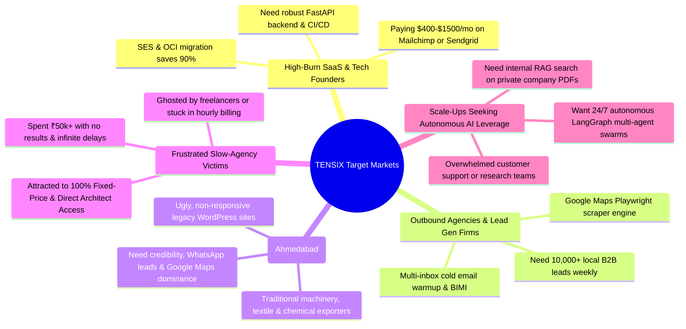

# 🎯 TENSIX Target Markets & Buyer Personas MOC

> **"Sell what high-growth businesses and busy founders are actively losing sleep over: high recurring SaaS bills, broken email deliverability, slow outdated websites, manual data entry drain, and missing AI leverage."**

This Map of Content (MOC) analyzes the specific **Ideal Customer Profiles (ICPs)**, target market verticals, geographic positioning, and acquisition funnels utilized by [[TENSIX-Master-MOC|TENSIX]].

---

## 👥 The 5 Core Buyer Archetypes (ICPs)

---

## 🔍 Detailed Archetype Teardown

### Archetype 1: The High-Burn SaaS & Startup Founder
- **Who they are:** Bootstrapped or seed-funded software founders, newsletter creators, or eCommerce store owners with 25,000–200,000 email subscribers.
- **Burning Pain:** Bleeding $300 to $1,500 every single month on Mailchimp, Klaviyo, or Sendgrid for simple transactional and broadcast emails.
- **The Hook:** *"Cut your monthly email infrastructure bill by 90% permanently with dedicated Amazon SES and Oracle OCI email pipelines."*
- **Target Offering:** [[TENSIX-Enterprise-Email-And-SES-Delivery-Engine|Tier 2: Amazon SES & Oracle Dedicated Engine (₹22,999)]].
- **ROI Calculation:** The setup pays for itself in less than 45 days; subsequent savings are pure profit forever.

### Archetype 2: The Outbound B2B Agency & Sales Team
- **Who they are:** Growth marketing agencies, cold calling operations, recruiting agencies, and B2B SaaS sales development representatives (SDRs).
- **Burning Pain:** Apollo/ZoomInfo subscriptions are too expensive or contain stale phone numbers; manual data scraping takes 15–20 hours per week per VA.
- **The Hook:** *"Stop paying per-lead subscriptions. Deploy a private, high-velocity Google Maps & web crawler that extracts verified business leads 24/7 directly into your CRM."*
- **Target Offering:** [[TENSIX-Data-Scraping-And-Automated-Inbox-Parsers|Tier 2: Google Maps & B2B Lead Scraper Engine (₹24,999)]].

### Archetype 3: The Ahmedabad & Gujarat MSME Exporter
- **Who they are:** Business owners in Navrangpura, SG Highway, Sanand, Vatva, and Changodar running chemical, pharmaceutical, ceramic, and engineering export firms.
- **Burning Pain:** Have a slow, 8-year-old WordPress website that fails on mobile phones, has zero local SEO visibility, and yields zero international inquiries.
- **The Hook:** *"Turn your website into a high-credibility lead engine. 15+ pages engineered for instant trust, 95+ mobile speed, and direct WhatsApp inquiries from global buyers."*
- **Target Offering:** [[TENSIX-Web-Architecture-And-Redesign-Suite|Tier 2: Modern Lead Engine Website (₹24,999)]] or [[TENSIX-Web-Architecture-And-Redesign-Suite|Tier 3: Complete Digital Platform (₹45,000)]].

### Archetype 4: The Burned Freelancer / Agency Victim
- **Who they are:** Founders who hired cheap freelance marketplaces or generalist agencies, waited 4 months, received a buggy unfinished website, and were billed unexpected hourly overages.
- **Burning Pain:** Extreme trust deficit. Deep fear of being locked into ongoing retainers or receiving half-baked code.
- **The Hook:** *"100% Fixed-Price. Zero-Downtime Guarantee. Complete source code and server key ownership from Day 1. Direct access to Lead Architect Hemal Shah."*
- **Target Offering:** Any of the 6 productized suites with clear milestone deliveries.

### Archetype 5: The Enterprise AI Modernizer
- **Who they are:** Mid-sized companies with hundreds of internal PDFs, standard operating procedures (SOPs), and customer inquiries who want to adopt AI without leaking proprietary IP to public clouds.
- **Burning Pain:** Generic ChatGPT chatbots hallucinate, make up facts, and lack access to company databases.
- **The Hook:** *"Deploy a private GraphRAG knowledge base on your own Supabase cloud with pgvector embeddings and strict paragraph-level source citations."*
- **Target Offering:** [[TENSIX-Autonomous-AI-Swarms-And-GraphRAG|Tier 1: Custom RAG Assistant (₹29,999)]] or [[TENSIX-Autonomous-AI-Swarms-And-GraphRAG|Tier 2: Autonomous Multi-Agent Swarm (₹59,999)]].

---

## 📍 Geographic & Strategic Footprint
- **Local Epicenter:** Navrangpura, Ahmedabad, Gujarat (`23.0366° N, 72.5615° E`). Direct client acquisition through local B2B networking, regional organic search (GEO/AEO), and industrial cluster outreach.
- **National & Global Reach:** Remote delivery across India, the US, the UK, the UAE, and Singapore via GitHub, Docker, and remote cloud infrastructure access.

---

## 🔗 Related Graph Notes
- [[TENSIX-Master-MOC]]
- [[TENSIX-Services-And-Pricing-MOC]]
- [[TENSIX-Persuasion-And-Sales-Playbook-MOC]]
- [[TENSIX-Buyer-Personas-And-Target-Segments]]
- [[Ahmedabad_Entity_Dominance]]
