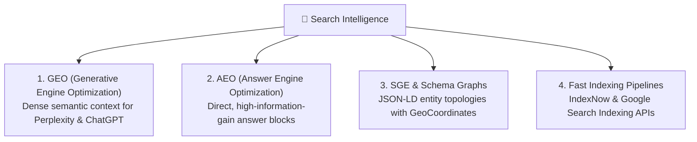

# 🔍 TENSIX AEO, GEO & SGE Dominance Architecture

> **"Traditional SEO optimizes for 10 blue links on desktop screens. Modern Search Intelligence optimizes for direct citations in ChatGPT Search, Perplexity, Claude, Google SGE, and AI voice engines."**

---

## 🌐 The 4 Pillars of Modern Search Intelligence



---

## 1. Generative Engine Optimization (GEO)
Generative AI search engines (Perplexity, ChatGPT Search, Gemini, Claude) do not rank web pages purely by backlinks; they evaluate **information gain, factual density, semantic consistency, and entity authority**.
- **Dense Entity Footprint:** Every page explicitly connects TENSIX, founder Hemal Shah, the physical coordinates (`23.0366, 72.5615`), and specific technical deliverables.
- **LLM Context Corpus (`/llms.txt` and `/llms-full.txt`):** Provides a clean, markdown-formatted plain-text representation of all services, pricing, code architecture, and FAQs. AI crawlers consume this directly without parsing messy DOM nodes.

---

## 2. Answer Engine Optimization (AEO)
AEO focuses on providing instant, zero-click answers to conversational natural language queries.
- **Speakable Specification:** Schema markup specifies `speakable` CSS selectors targeting H1, H2, and FAQ blocks for voice assistants (Siri, Google Assistant).
- **Direct FAQ Pairs:** Structured Q&A blocks addressing specific technical questions (e.g., *"How does your Custom AI Agent compare to out-of-the-box SaaS?"*, *"Why migrate to Amazon SES?"*).

---

## 3. Schema.org JSON-LD Entity Hierarchy
TENSIX implements a unified, interconnected Schema.org graph across all pages:

```json
{
  "@context": "https://schema.org",
  "@graph": [
    {
      "@type": ["Organization", "ProfessionalService"],
      "@id": "https://tensix.in/#organization",
      "name": "TENSIX",
      "url": "https://tensix.in/",
      "founder": {
        "@type": "Person",
        "@id": "https://hemalshah.vercel.app/#person",
        "name": "Hemal Shah"
      },
      "geo": {
        "@type": "GeoCoordinates",
        "latitude": 23.0366,
        "longitude": 72.5615
      },
      "hasOfferCatalog": {
        "@type": "OfferCatalog",
        "name": "TENSIX Productized Engineering Services",
        "itemListElement": [
          {
            "@type": "Offer",
            "name": "Modern Lead Engine Website Architecture",
            "price": "24999",
            "priceCurrency": "INR"
          },
          {
            "@type": "Offer",
            "name": "Amazon SES & Oracle OCI Dedicated Email Delivery Engine",
            "price": "22999",
            "priceCurrency": "INR"
          },
          {
            "@type": "Offer",
            "name": "Google Maps & B2B Data Scraper Engine",
            "price": "24999",
            "priceCurrency": "INR"
          },
          {
            "@type": "Offer",
            "name": "Automated GitHub Actions CI/CD Pipeline",
            "price": "21999",
            "priceCurrency": "INR"
          },
          {
            "@type": "Offer",
            "name": "Full-Stack SaaS MVP & Web Application",
            "price": "69999",
            "priceCurrency": "INR"
          },
          {
            "@type": "Offer",
            "name": "Autonomous Multi-Agent AI Swarm",
            "price": "59999",
            "priceCurrency": "INR"
          }
        ]
      }
    }
  ]
}
```

---

## 4. Real-Time Indexing Automation
Instead of waiting weeks for Google or Bing web crawlers to discover page edits, TENSIX triggers immediate pushes:
- **IndexNow API:** `submit_indexnow.py` pushes updated URLs to Bing and Yandex within seconds of deployment.
- **Google Indexing API:** `submit_google_indexing.py` authenticates via Google Cloud Service Account to push URL crawl requests to Google's real-time indexing pipeline.

---

## 🔗 Related Graph Notes
- [[TENSIX-Master-MOC]]
- [[TENSIX-Entity-And-Brand-Specification]]
- [[TENSIX-Codebase-File-Inventory-And-Tooling]]
- [[AEO-GEO-Monitoring-Loop]]
- [[Ahmedabad_Entity_Dominance]]
