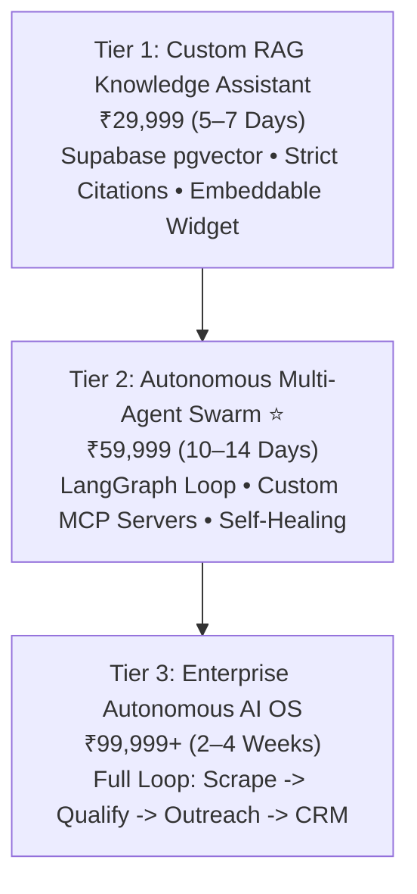
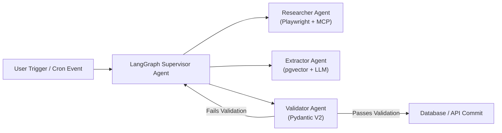

# 🧠 TENSIX Autonomous AI Swarms & GraphRAG

> **"Deploy 24/7 autonomous multi-agent AI swarms and private GraphRAG knowledge bases that automate research, data synthesis, and enterprise operations with zero human bottleneck."**

---

## 🎯 Target Problem & Market Opportunity
Organizations want to leverage LLMs (Claude, GPT-4o, LLaMA), but hit three critical barriers:
1. **Hallucinations & Generic Answers:** Generic ChatGPT wrappers make up inaccurate answers, lack context about proprietary company documents, and fail to provide exact page-level citations.
2. **Fragile Single-Prompt Chatbots:** Simple chatbots cannot perform multi-step workflows like researching, writing, verifying code, calling external APIs, and committing data to databases.
3. **Data Privacy Fears:** Companies cannot risk uploading confidential legal contracts, patents, or financial records to public consumer AI platforms.

TENSIX builds **private GraphRAG knowledge systems and LangGraph multi-agent autonomous swarms** hosted securely within the client's own cloud perimeter.

---

## 💼 The 3 Tiered Productized Packages

### Plan 1: Custom Internal RAG Knowledge Assistant — ₹29,999 (One-Time)
- **Target Client:** Legal firms, consultancies, technical support desks, and documentation-heavy enterprises.
- **Deliverables:**
  - Private Vector Database Embeddings on Supabase (pgvector) using state-of-the-art embedding models.
  - Embeddable Web Chat Widget or Internal Slack / WhatsApp Bot integration.
  - Strict Source Citations: The AI explicitly displays the exact PDF title, paragraph, and page number for every claim it makes.
  - Admin Knowledge Upload Interface: Drag-and-drop dashboard allowing staff to upload new PDFs, Word docs, and markdown files anytime.
- **Turnaround:** 5–7 Business Days.
- **Anchor:** *Replaces 10+ hours of weekly manual document search per employee.*

### Plan 2: Autonomous Multi-Agent Swarm — ₹59,999 (One-Time) ⭐ *(Flagship TENSIX Innovation)*
- **Target Client:** Content operations, market research firms, quantitative data agencies, and tech scale-ups.
- **Deliverables:**
  - Multi-Agent Orchestration Swarm built with LangGraph, Python 3.12+, and n8n:
    - *Agent 1 (Researcher):* Searches internal databases and external APIs for raw facts.
    - *Agent 2 (Synthesizer/Writer):* Drafts structured reports, code, or analysis.
    - *Agent 3 (Reviewer/Validator):* Cross-examines drafts against factual benchmarks and unit tests.
    - *Agent 4 (Publisher/Executor):* Deploys output to CMS, GitHub, or database.
  - Custom FastMCP Tool Servers connecting LLMs directly to client APIs and SQL databases.
  - Self-Healing Error Correction Loops with deterministic quality gates.
- **Turnaround:** 10–14 Business Days.
- **Anchor:** *Replaces a 5-person manual research and publishing department.*

### Plan 3: Enterprise Autonomous AI OS — ₹99,999+ (Custom Scope) *(Total Business Autonomy)*
- **Target Client:** Enterprise businesses seeking complete operational automation.
- **Deliverables:**
  - End-to-End Autonomous Business Pipeline: Scrape lead -> AI qualify -> Enrich corporate profile -> Generate personalized pitch -> Send email -> Book calendar call -> Update CRM.
  - Multi-Modal Pipeline: Voice call audio transcription (Whisper), Document OCR, and vision model reasoning.
  - Real-Time Telemetry Dashboard with human-in-the-loop review and kill-switch controls.
  - Dedicated Cloud Deployment on private GPU/CPU instances.
- **Turnaround:** 2–4 Weeks.
- **Anchor:** *Unrivaled operational leverage delivering 10x corporate throughput.*

---

## 🧬 Architectural Topology: LangGraph & FastMCP

---

## 🔗 Related Graph Notes
- [[TENSIX-Services-And-Pricing-MOC]]
- [[TENSIX-Data-Scraping-And-Automated-Inbox-Parsers]]
- [[TENSIX-Custom-Software-And-SaaS-Architecture]]
- [[Autonomous-Software-Economy-MOC]]
