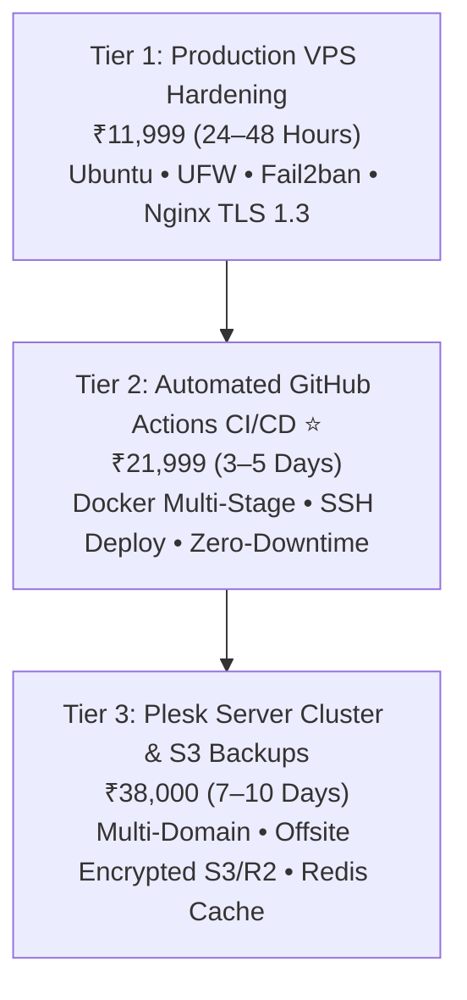

# ☁️ TENSIX Cloud VPS Hardening & CI/CD Pipelines

> **"Eliminate server crashes, security breaches, and painful manual FTP uploads with automated GitHub Actions CI/CD pipelines, Docker containerization, and military-grade VPS hardening."**

---

## 🎯 Target Problem & Market Opportunity
Most growing companies run fragile, unhardened infrastructure:
1. **Manual Deployment Nightmare:** Developers manually drag and drop files via FTP or run chaotic SSH commands on production servers, leading to accidental syntax errors and website downtime.
2. **Server Vulnerabilities:** Default VPS installations have open SSH ports on port 22, root login enabled without key authentication, zero firewall rules, and no brute-force intrusion defense.
3. **Missing Disaster Recovery:** Backups are either nonexistent or stored on the same server partition, guaranteeing catastrophic data loss if the VPS crashes.

TENSIX implements **zero-downtime automated deployment pipelines on GitHub Actions and bulletproof Linux server hardening on Oracle Cloud (OCI) and Plesk Linux**.

---

## 💼 The 3 Tiered Productized Packages

### Plan 1: Production VPS Hardening & Setup — ₹11,999 (One-Time)
- **Target Client:** Any business launching an Ubuntu VPS on Oracle Cloud (OCI), DigitalOcean, Linode, AWS Lightsail, or Hetzner.
- **Deliverables:**
  - Ubuntu 24.04 LTS OS Provisioning & Package Hardening.
  - SSH Hardening: Disable password authentication, enforce Ed25519 public key pairs, and change default SSH port.
  - Intrusion Prevention: UFW (Uncomplicated Firewall) rules + Fail2ban daemon banning malicious IPs automatically.
  - Nginx Reverse Proxy with HTTP/2, TLS 1.3, and Automated Let's Encrypt SSL/TLS Certificate auto-renewal.
  - System Monitoring & RAM/CPU resource threshold alerts.
- **Turnaround:** 24–48 Hours Express.
- **Anchor:** *Prevents ransomware attacks, unauthorized crypto-mining, and server blacklisting.*

### Plan 2: Automated GitHub Actions CI/CD Pipeline — ₹21,999 (One-Time) ⭐ *(Best Value)*
- **Target Client:** Software startups, digital agencies, and dev teams wanting seamless push-to-deploy workflows.
- **Deliverables:**
  - Complete `.github/workflows/deploy.yml` Pipeline: Triggered automatically on `git push origin main`.
  - Automated Steps: Code Linting -> Test Execution -> Docker Multi-Stage Image Build -> Secure SSH Server Handshake -> Zero-Downtime Container Swap.
  - Automated Database Migration Hooks (Prisma, Alembic, or TypeORM) running safely before traffic cutover.
  - Rollback Strategy: Instant automatic rollback if a new build fails health checks.
  - Real-Time Telegram / Slack Notifications with build status, commit hash, and deploy duration.
- **Turnaround:** 3–5 Business Days.
- **Anchor:** *Saves developers 5+ hours every week and eliminates production deployment anxiety.*

### Plan 3: Plesk Server Cluster & S3 Backups — ₹38,000 (One-Time) *(Production Enterprise)*
- **Target Client:** Agencies managing multiple client websites, or enterprises requiring high-availability hosting.
- **Deliverables:**
  - Multi-Domain Plesk Obsidian Enterprise Linux Configuration.
  - Automated Daily & Weekly Encrypted Offsite Backups streaming directly to Cloudflare R2 or AWS S3.
  - High-Speed Caching: Redis in-memory object caching + PHP-FPM / Node.js worker pool tuning.
  - Complete Disaster Recovery Runbook with 1-Click Restore Testing.
- **Turnaround:** 7–10 Business Days.
- **Anchor:** *Guarantees total business continuity even in the event of hardware or datacenter failure.*

---

## 🔒 Security Baseline Checklist Implemented
- [x] Non-root sudo user with restricted privilege escalation
- [x] SSH root login disabled (`PermitRootLogin no`)
- [x] Password authentication disabled (`PasswordAuthentication no`)
- [x] UFW strictly allowing only ports 80, 443, and custom SSH port
- [x] Fail2ban active on SSH and Nginx auth
- [x] Automated security updates enabled (`unattended-upgrades`)
- [x] Encrypted SSL with A+ rating on SSL Labs

---

## 🔗 Related Graph Notes
- [[TENSIX-Services-And-Pricing-MOC]]
- [[TENSIX-Custom-Software-And-SaaS-Architecture]]
- [[TENSIX-Enterprise-Email-And-SES-Delivery-Engine]]
- [[TENSIX-Codebase-And-Architecture-MOC]]
