# 🛠️ TENSIX Codebase File Inventory & Tooling

> **"A rigorous, production-grade codebase combining zero-bloat semantic HTML5 with an automated Python toolchain for schema generation, SEO audits, and AI crawler synthesis."**

This document catalogues the files, scripts, and engineering tools in `H:\portfolio_website\tensix`.

---

## 🐍 1. The Python Automation & Verification Suite

| Script | Purpose & Functionality |
| :--- | :--- |
| **`regen_llms.py`** | Compiles all markdown files, schemas, and architecture specs into the unified 92k+ character `llms-full.txt` corpus for AI search crawlers. |
| **`submit_indexnow.py`** | Dispatches batch URL indexing notifications directly to Bing, Yandex, and Naver search engines via the IndexNow protocol. |
| **`ping_indexnow.py`** | Lightweight script for pinging individual changed URLs to the IndexNow API. |
| **`submit_google_indexing.py`** | Interacts with the Google Search Indexing API using `google-service-account.json` to request immediate URL crawls. |
| **`build_schema_web.py`** | Generates and injects standardized Schema.org JSON-LD graph structures across root HTML pages. |
| **`validate_schemas.py`** | Parses `<script type="application/ld+json">` tags across all HTML files to ensure 100% valid JSON and schema conformance. |
| **`build_sitemaps.py` & `build_sitemap.py`** | Constructs XML sitemaps with proper hreflang definitions, lastmod dates, and priority weighting. |
| **`analyze_seo.py`** | Static HTML linter checking for missing H1 tags, duplicate meta descriptions, missing alt text, and broken links. |
| **`run_full_audit.py`** | Executes end-to-end accessibility, performance, and semantic HTML verification across all pages. |
| **`enterprise_optimizations.py`** | Injects high-performance preconnects, DNS-prefetch hints, and resource hints. |
| **`fix_accessibility.py`** | Enforces WCAG 2.1 AA accessibility standards (ARIA landmarks, focus rings, contrast checks). |
| **`cache_bust.py`** | Appends version query parameters (e.g., `?v=1.3`) to CSS, JS, and image assets to invalidate CDN caches. |

---

## 📄 2. Production HTML Pages (Pillars & Hubs)

```mermaid
graph TD
    Root["https://tensix.in/"] --> Core["Core Navigation"]
    Root --> Hubs["Regional & Entity Hubs"]
    Root --> Case["Project Case Studies"]

    Core --> P1["index.html (Home & Architecture)"]
    Core --> P2["services.html (Productized Suites & Pricing)"]
    Core --> P3["about.html (Founding Story & Leadership)"]
    Core --> P4["work.html (Project Showcase & Case Studies)"]
    Core --> P5["contact.html (Lead Capture & WhatsApp)"]
    Core --> P6["blogs.html (Technical Spoke Hub)"]

    Hubs --> H1["navrangpura.html (Navrangpura Local Hub)"]
    Hubs --> H2["ahmedabad-software-engineering.html (Ahmedabad Tech Hub)"]
    Hubs --> H3["hk-engineering-ahmedabad.html (Entity Transition Record)"]

    Case --> C1["wr1.html (Stealth Playwright Crawler Deep-Dive)"]
    Case --> C2["frameworks.html (Technical Architecture Frameworks)"]
    Case --> C3["resources.html (Technical Whitepapers & Schemas)"]
    Case --> C4["whoami.html (Terminal-Style Technical CV)"]
```

---

## 🎨 3. JavaScript Runtime Engine (`script.js`)

`script.js` is structured as a **modular Vanilla ES6 engine** designed for sub-second hydration and zero main-thread blocking:
1. **`SafeInit` Wrapper:** Protects execution flow; if any single non-critical DOM effect throws an error, the rest of the application initializes uninterrupted.
2. **Critical Path Initialization (Immediate):**
   - `initMobileNav`: Mobile drawer menu with accessible ARIA toggle.
   - `initScrollHeader`: Dynamically switches glassmorphic navbar styles on scroll.
   - `initReveal`: Native `IntersectionObserver` triggering smooth scroll fade-in reveals.
   - `initSkillBars`: Animates technical proficiency meters when scrolled into viewport.
3. **Deferred Enhancements (via `requestIdleCallback`):**
   - `initCursorGlow`: Subtle ambient mouse tracker effect.
   - `initSpotlightCards`: Radial gradient hover spotlighting on project cards.
   - `initTiltCards`: 3D gyroscope tilt effect on desktop pointers.
   - `initMagneticDock`: macOS-inspired floating navigation dock at the bottom of the viewport.
4. **Interactive Service Tab Switching:**
   - `switchPricing(groupId, btn)`: Zero-latency tab switcher activating selected service categories on `services.html`.

---

## 🛡️ 4. Edge Deployment & Security (`vercel.json`)

`vercel.json` configures enterprise HTTP response headers for all edge requests:
- **`Content-Security-Policy (CSP)`**: Restricts executable script sources to approved CDNs and self.
- **`Strict-Transport-Security (HSTS)`**: Enforces HTTPS with `max-age=63072000; includeSubDomains; preload`.
- **`X-Content-Type-Options: nosniff`**: Prevents MIME-type sniffing attacks.
- **`X-Frame-Options: SAMEORIGIN`**: Protects against clickjacking.
- **`Referrer-Policy: strict-origin-when-cross-origin`**: Ensures secure cross-origin referral privacy.

---

## 🔗 Related Graph Notes
- [[TENSIX-Codebase-And-Architecture-MOC]]
- [[TENSIX-Master-MOC]]
- [[TENSIX-AEO-GEO-SGE-Dominance-Architecture]]
- [[MASTER_PROMPT]]
