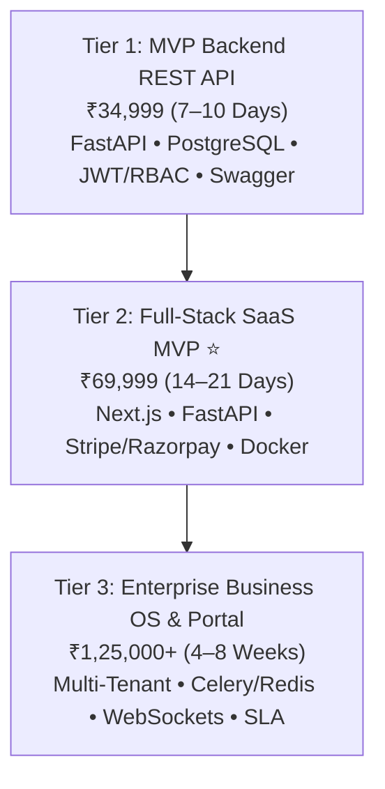

# ⚡ TENSIX Custom Software & SaaS Architecture

> **"Transform your product vision into a high-concurrency, scalable web application or SaaS MVP built with FastAPI, Next.js App Router, and PostgreSQL in weeks, not months."**

---

## 🎯 Target Problem & Market Opportunity
Entrepreneurs and businesses building custom software frequently run into catastrophic delays:
1. **The 6-Month Agency Blackhole:** Traditional software agencies charge ₹5,00,000 to ₹15,00,000 and take 6 to 9 months to deliver a basic MVP that is already outdated upon launch.
2. **Fragile Architecture:** Code written by amateur freelancers collapses under traffic because of synchronous blocking I/O, unindexed SQL queries, and missing database connection pools.
3. **Billing & Auth Friction:** Integrating multi-tenant role-based access control (RBAC), JWT authentication, and recurring Stripe/Razorpay webhooks often takes junior developers months to get right.

TENSIX builds **production-ready, high-concurrency software architectures** using an asynchronous modern Python and Next.js stack with clean, modular code.

---

## 💼 The 3 Tiered Productized Packages

### Plan 1: Full-Stack MVP Backend API — ₹34,999 (One-Time)
- **Target Client:** Mobile app developers, frontend engineers, or founders needing a robust backend engine.
- **Deliverables:**
  - Asynchronous High-Speed REST API built with FastAPI (Python 3.12+) or Node.js.
  - Relational Database Modeling on PostgreSQL with Prisma / SQLAlchemy ORM.
  - Secure Authentication: JWT tokens with refresh cycles, password hashing with bcrypt, Role-Based Access Control (RBAC), and IP rate limiting.
  - Complete Interactive API Documentation: Swagger UI and ReDoc (OpenAPI 3.1) endpoints.
- **Turnaround:** 7–10 Business Days.
- **Anchor:** *Provides a rock-solid backend foundation that easily scales to 100,000+ daily requests.*

### Plan 2: Full-Stack SaaS MVP & Web Application — ₹69,999 (One-Time) ⭐ *(Most Popular)*
- **Target Client:** SaaS founders, B2B product creators, and modern digital business operators.
- **Deliverables:**
  - Complete Full-Stack Web Application: Next.js App Router (TypeScript) frontend + FastAPI async backend.
  - Subscription & Payment Infrastructure: Stripe Billing or Razorpay Subscriptions with automated webhook handling.
  - Authenticated User Dashboard: User login/signup, password reset, profile management, and team invitations.
  - Database Schema & Migrations: Multi-table relational PostgreSQL schema with optimized indexes.
  - Production Deployment: Dockerized multi-stage container deployment on Cloud VPS with automated SSL.
- **Turnaround:** 14–21 Business Days.
- **Anchor:** *Traditional development shops charge ₹3,00,000+ for an identical SaaS MVP scope.*

### Plan 3: Enterprise Business OS & Portal — ₹1,25,000+ (Custom Scope) *(Enterprise Scale)*
- **Target Client:** Enterprises, high-growth scale-ups, and organizations digitizing internal operational workflows.
- **Deliverables:**
  - Multi-Tenant Architecture with isolated tenant schemas or database partitioning.
  - Asynchronous Distributed Task Queues: Powered by Redis, Celery, or RabbitMQ for long-running batch jobs.
  - Real-Time WebSockets Engine: Live notifications, activity feeds, and telemetry streaming.
  - Custom Admin Operations Portal: Financial metrics, user audit logs, and permission governance.
  - Enterprise SLA & Dedicated Architecture Consulting.
- **Turnaround:** 4–8 Weeks.
- **Anchor:** *Replaces bloated, rigid enterprise software costing millions in annual licensing.*

---

## 🛠️ Stack Specifications
- **Frontend:** Next.js 14/15 (App Router, Server Components), TypeScript, Tailwind CSS, Lucide icons.
- **Backend:** FastAPI (Python 3.12+), Pydantic V2, Uvicorn, Asyncpg.
- **Database:** PostgreSQL on Supabase or self-hosted Docker, Redis for caching and session rate-limiting.
- **Authentication:** OAuth2 with Password (and hashing), JWT bearer tokens, CORS protection.
- **Billing:** Stripe Elements / Checkout & Razorpay Payment Links with webhook verification.

---

## 🔗 Related Graph Notes
- [[TENSIX-Services-And-Pricing-MOC]]
- [[TENSIX-Cloud-VPS-Hardening-And-CICD-Pipelines]]
- [[TENSIX-Autonomous-AI-Swarms-And-GraphRAG]]
- [[TENSIX-Buyer-Personas-And-Target-Segments]]
