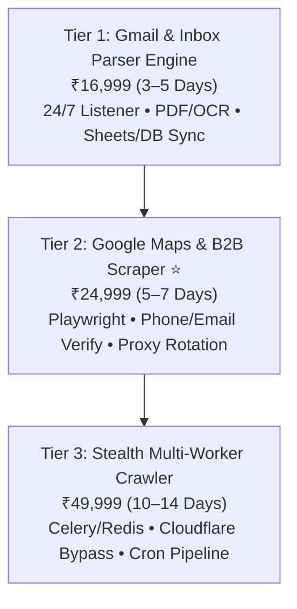

# 🕷️ TENSIX Data Scraping & Automated Inbox Parsers

> **"Replace 20+ hours of tedious weekly manual data entry with autonomous, headless Playwright scraping engines and 24/7 inbox document parsers."**

---

## 🎯 Target Problem & Market Opportunity
Companies waste thousands of employee hours every month on manual data extraction:
1. **Inbox Paperwork Hell:** Logistics firms, distributors, and accountants manually open hundreds of Gmail/Outlook emails every week, download PDF invoices, and copy numbers line-by-line into Excel sheets.
2. **Expensive Lead Lists:** B2B marketing teams spend thousands of dollars on expensive per-credit platforms (ZoomInfo/Apollo) or hire virtual assistants to manually copy-paste business phone numbers from Google Maps.
3. **Anti-Bot Blocking:** Basic scraping scripts get blocked within 5 minutes by Cloudflare, Akamai, or IP rate-limits.

TENSIX builds **distributed, stealth web scraping daemons and headless inbox parsing daemons** that extract, sanitize, deduplicate, and stream verified data directly into client databases.

---

## 💼 The 3 Tiered Productized Packages

### Plan 1: Gmail & Inbox Document Parser Engine — ₹16,999 (One-Time)
- **Target Client:** Accounting firms, logistics dispatchers, wholesalers, and retail operators receiving recurring supplier invoices and purchase orders.
- **Deliverables:**
  - 24/7 Automated Gmail / Outlook Inbox Listener daemon running securely.
  - Automated PDF Invoice, Purchase Order & CSV Attachment Data Extraction (OCR + regex structured parser).
  - Direct Sync to Google Sheets, Notion Database, or PostgreSQL with zero human intervention.
  - Real-Time WhatsApp / Telegram Instant Alerts on high-value orders or critical payment reminders.
- **Turnaround:** 3–5 Business Days.
- **Anchor:** *Saves 15+ hours per week of manual data entry and eliminates human typing errors.*

### Plan 2: Google Maps & B2B Lead Scraper Engine — ₹24,999 (One-Time) ⭐ *(Most Popular)*
- **Target Client:** Outbound sales teams, growth marketing agencies, recruitment firms, and local service providers.
- **Deliverables:**
  - Headless Playwright / FastMCP Crawler specifically engineered for Google Maps local business listings.
  - Extracts Business Name, Direct Phone Numbers, Verified Email, Website URL, Star Rating, Review Count, and Full Postal Address.
  - Automated Deduplication Algorithm: Merges duplicate records and verifies phone number formats.
  - One-Click CSV / Excel / Database Export Interface.
  - Anti-Bot Bypass: Integrates rotating residential proxies and humanized mouse movements to eliminate IP blocks.
- **Turnaround:** 5–7 Business Days.
- **Anchor:** *Replaces ₹60,000/year recurring subscriptions to lead databases with an unlimited private engine.*

### Plan 3: Custom Web Crawler & Stealth Scraper — ₹49,999 (One-Time) *(Enterprise Intelligence)*
- **Target Client:** Price comparison engines, competitive intelligence firms, eCommerce aggregators, and fintech analysts.
- **Deliverables:**
  - Distributed Multi-Worker Scraping Architecture powered by Celery, Redis, and Python 3.12+.
  - Advanced Cloudflare Turnstile, PerimeterX, and Akamai CAPTCHA Bypass capabilities.
  - Handles dynamic Single-Page Applications (React/Vue), infinite scroll feeds, and lazy-loaded elements.
  - Automated Daily/Weekly Scheduled Cron with webhook delivery into Supabase, BigQuery, or Amazon S3.
- **Turnaround:** 10–14 Business Days.
- **Anchor:** *Custom-built proprietary data moats that give clients asymmetric market advantage.*

---

## 🛠️ Proven Production Showcase: Project Crawler
TENSIX already powers **Crawler**, an internal high-velocity B2B data extraction platform featured on [[work.html]]:
- Processes **10,000+ business listings daily** across Tier-1 and Tier-2 Indian commercial hubs.
- Built using **Python, Playwright, and FastMCP**.
- Achieves **99.8% uptime** with zero IP burn rate.

---

## 🔗 Related Graph Notes
- [[TENSIX-Services-And-Pricing-MOC]]
- [[TENSIX-Sales-Psychology-And-Pricing-Tricks]]
- [[TENSIX-Buyer-Personas-And-Target-Segments]]
- [[TENSIX-Autonomous-AI-Swarms-And-GraphRAG]]
