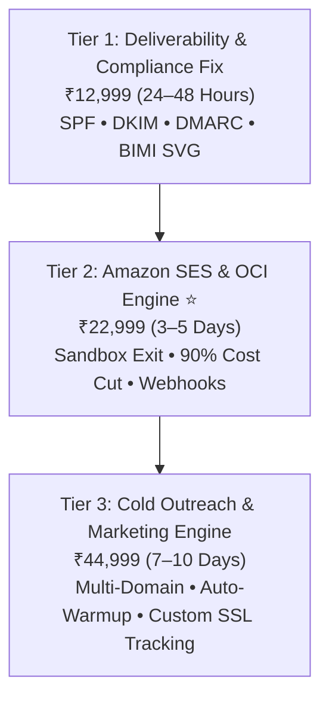

# 📬 TENSIX Enterprise Email & SES Delivery Engine

> **"Stop burning $500–$1,500/month on Mailchimp or Klaviyo. Deploy private, dedicated enterprise email infrastructure on Amazon SES and Oracle Cloud with 99.5% inbox placement and 90% cost savings."**

---

## 🎯 Target Problem & Market Opportunity
Modern companies face two catastrophic email bottlenecks:
1. **The Commercial SaaS Trap:** Services like Mailchimp, Klaviyo, and Sendgrid charge exorbitant recurring monthly subscriptions based on email list size, even if you rarely send emails. A list of 50,000 contacts routinely costs $400 to $900 every month.
2. **Deliverability Disasters:** Google and Yahoo enforce strict email authentication policies (February 2024+ mandate). Companies without valid SPF, DKIM, and strict DMARC (`p=reject` or `p=quarantine`) have their transactional and marketing emails dumped directly into the spam folder or rejected outright.

TENSIX resolves both bottlenecks by building **dedicated, private cloud email delivery engines** on Amazon SES or Oracle Cloud Infrastructure (OCI).

---

## 💼 The 3 Tiered Productized Packages

### Plan 1: Email Deliverability & Compliance Fix — ₹12,999 (One-Time)
- **Target Client:** Businesses whose emails are landing in customer spam folders, or companies failing Google/Yahoo authentication checks.
- **Deliverables:**
  - Full DNS Audit & Alignment: SPF, DKIM (2048-bit), DMARC (`p=quarantine` or `p=reject`), and MX records.
  - Google Workspace & Microsoft 365 100% Inbox Placement Hardening.
  - IP & Domain Blacklist Check and Immediate Remediation.
  - BIMI (Brand Indicators for Message Identification) Setup with certified SVG logo display in recipient inboxes.
- **Turnaround:** 24–48 Hours Express.
- **Anchor:** *Prevents lost deals caused by invisible spam folder deliveries.*

### Plan 2: Amazon SES & Oracle OCI Dedicated Engine — ₹22,999 (One-Time) ⭐ *(Best Value)*
- **Target Client:** SaaS platforms, newsletter operators, eCommerce brands, and businesses sending 10,000 to 500,000 emails per month.
- **Deliverables:**
  - Guaranteed Amazon SES Production Sandbox Removal (50,000+ daily sending quota).
  - Alternative: Oracle Cloud Infrastructure (OCI) Email Delivery engine setup with dedicated high-reputation IP.
  - Slashes ongoing email delivery costs by up to 90% (Amazon SES costs only $0.10 per 1,000 emails; OCI offers 3,000 free emails daily).
  - Automated Inbound Event Webhooks: Bounces, spam complaints, and unsubscribe events captured directly into SQLite / PostgreSQL.
  - SMTP & API Integration with client applications (WordPress, Next.js, Node.js, FastAPI).
- **Turnaround:** 3–5 Business Days.
- **Anchor:** *Saves ₹1,80,000+ annually in recurring Mailchimp/Sendgrid subscription fees.*

### Plan 3: Cold Outreach & Marketing Engine — ₹44,999 (One-Time) *(Outbound Scaler)*
- **Target Client:** B2B sales teams, cold email agencies, and recruiting firms running outbound campaigns.
- **Deliverables:**
  - Multi-Domain & Multi-Inbox Infrastructure Setup (3–5 Dedicated Secondary Domains to protect the primary brand domain).
  - Automated Inbox Warmup Pipeline Configuration (Instantly / Smartlead / Mailreach integration).
  - Custom Tracking Domain (CNAME with SSL) ensuring click tracking does not trip spam filters.
  - Automated Reminder & Drip Sequence Architecture with webhook logging.
- **Turnaround:** 7–10 Business Days.
- **Anchor:** *Protects your primary business domain from being permanently blacklisted by Google.*

---

## 💰 The Math: Mailchimp vs. Amazon SES / Oracle OCI

| Metric | Mailchimp (50,000 Contacts) | Amazon SES / Oracle OCI Engine (TENSIX) |
| :--- | :--- | :--- |
| **Monthly Cost** | **₹28,000 – ₹38,000/mo** | **₹400 – ₹1,200/mo** (Pure usage at $0.10/1k) |
| **1-Year Expense** | **₹3,36,000 – ₹4,56,000** | **₹22,999 (Setup)** + ~₹10,000 usage = **₹32,999** |
| **Annual Savings** | ₹0 | **₹3,00,000+ Net Profit Saved** |
| **Data Privacy** | Stored on third-party SaaS | Stored on client's own AWS/OCI cloud account |

---

## 🔗 Related Graph Notes
- [[TENSIX-Services-And-Pricing-MOC]]
- [[TENSIX-Sales-Psychology-And-Pricing-Tricks]]
- [[TENSIX-Buyer-Personas-And-Target-Segments]]
- [[TENSIX-Cloud-VPS-Hardening-And-CICD-Pipelines]]
