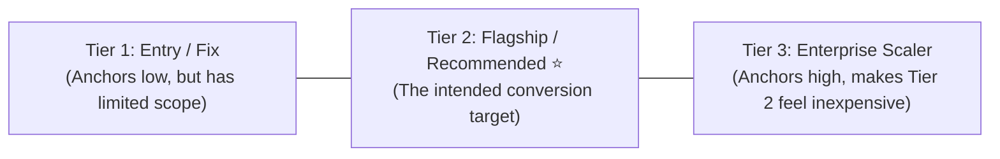

# 🧠 TENSIX Sales Psychology & Pricing Tricks

> **"Pricing is never an objective calculation of hours worked. Pricing is psychological positioning, risk mitigation, and value framing."**

This document details the behavioral economics principles, pricing psychology, and conversion copy patterns embedded into [[services.html|TENSIX Services Architecture]].

---

## 🔬 1. Price Anchoring & Asymmetric Comparison

### The Psychological Mechanism
Humans have no innate metric for evaluating the true value of software code. If an agency quotes ₹24,999 without context, the prospect compares it against free open-source templates or ₹3,000 freelance gigs.
To control the evaluation, we **anchor the comparison against an expensive or painful alternative**.

### The Mathematical Formula:
$$\text{Perceived Value} = \text{Cost of Established Pain} - \text{TENSIX Fixed Investment}$$

### The TENSIX Anchors:
1. **Web Redesign Suite:**
   - Anchor: *"Traditional agencies quote ₹60,000–₹1,20,000 with 3-month turnaround times."*
   - TENSIX Price: **₹24,999**
   - Framing: Client saves ₹35,000+ immediately while getting a faster 7–10 day delivery.
2. **Email Delivery Suite:**
   - Anchor: *"Mailchimp costs $400/month (₹33,000/mo = ₹3,96,000/yr) for 50k subscribers."*
   - TENSIX Price: **₹22,999 one-time**
   - Framing: Complete payback in 25 days; subsequent savings are pure annual profit.
3. **Scraping Suite:**
   - Anchor: *"Hiring a manual data entry virtual assistant costs ₹30,000/mo (₹3,60,000/yr)."*
   - TENSIX Price: **₹24,999 one-time**
   - Framing: Replaces an entire manual role with an automated 24/7 daemon.

---

## 🎯 2. The Center-Stage Compromise Effect (Decoy Architecture)

In every productized vertical, TENSIX deploys 3 tiers:

1. **Tier 1 (The Lower Anchor):**
   - Inexpensive enough to attract budget-conscious buyers, but intentionally lacks advanced capabilities (e.g., database storage, sandbox removal, anti-bot proxies).
   - Functions as proof that TENSIX is accessible.
2. **Tier 2 (The Target Conversion):**
   - Highlighted visually with glowing gradient borders (`Most Popular` / `Best Value` badge).
   - Contains the exact sweet-spot features that 80% of serious buyers need.
   - Converts at the highest volume.
3. **Tier 3 (The Ceiling Anchor):**
   - High investment tier (e.g., ₹45,000, ₹69,999, ₹1,25,000+).
   - Makes Tier 2 feel completely affordable and sensible by contrast.

---

## 🛡️ 3. The Risk Reversal Shield (Eliminating Friction)

The primary reason buyers stall at checkout is **fear of regret**. TENSIX neutralizes this with four contractual pillars:
- **100% Fixed-Price:** Eliminates fear of runaway agency hourly invoices.
- **Zero-Downtime Guarantee:** Eliminates fear of broken websites or lost revenue during migrations.
- **Complete IP Ownership:** Eliminates fear of proprietary vendor lock-in.
- **Direct Architect Access:** Eliminates fear of dealing with junior customer service representatives.

---

## ✍️ 4. Outcome-Driven Copywriting Over Feature Dumps

| Bad (Feature-Focused) Copy | Good (Outcome-Driven TENSIX Copy) |
| :--- | :--- |
| "We write Next.js and React code." | **"15+ custom business pages with sub-second mobile load speeds and automated lead capture."** |
| "We configure DNS SPF and DKIM records." | **"Stop landing in spam. Achieve 99.5% inbox placement and pass Google/Yahoo 2024 compliance."** |
| "We develop Python web crawlers with Playwright." | **"Pull 10,000+ verified B2B phone numbers & emails weekly directly from Google Maps into your CRM."** |
| "We set up Docker and GitHub Actions." | **"Eliminate deployment anxiety. Push code to main and watch zero-downtime server swaps happen automatically."** |

---

## 🔗 Related Graph Notes
- [[TENSIX-Persuasion-And-Sales-Playbook-MOC]]
- [[TENSIX-Services-And-Pricing-MOC]]
- [[TENSIX-Buyer-Personas-And-Target-Segments]]
- [[MASTER_PROMPT]]
