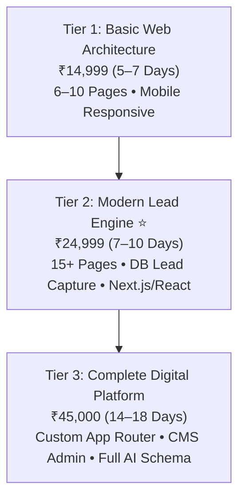

# 🌐 TENSIX Web Architecture & Redesign Suite

> **"Turn slow, outdated websites into ultra-fast, mobile-first lead capture engines that establish instant authority and convert visitors into qualified buyers."**

---

## 🎯 Target Problem & Market Opportunity
Thousands of MSMEs, export houses, and B2B firms suffer from outdated websites built on bloated WordPress themes or slow drag-and-drop builders (Wix/Squarespace). Common failure points include:
1. **Lighthouse scores below 40:** Mobile bounce rates exceed 60% before visitors even view the hero headline.
2. **Broken Lead Infrastructure:** Contact forms fail silently or route leads to unmonitored email inboxes.
3. **Zero Conversion Architecture:** Missing sticky WhatsApp actions, lack of direct click-to-call buttons, and unoptimized layout hierarchies.
4. **Fear of Migration:** Businesses avoid redesigning because they fear losing their hard-earned Google search rankings.

TENSIX eliminates these pain points through **guaranteed 95+ mobile PageSpeed scores, automated database lead capture, zero-downtime cutovers, and rigorous 301 redirect mapping**.

---

## 💼 The 3 Tiered Productized Packages

### Plan 1: Basic Web Architecture — ₹14,999 (One-Time)
- **Target Client:** Early-stage startups, solo practitioners, local retailers needing a credible digital storefront.
- **Deliverables:**
  - 6–10 Professional Business Pages (Home, About, Services, Case Studies, Contact).
  - 100% Mobile & Tablet Responsive UI/UX with smooth micro-animations.
  - WhatsApp Quick-Action CTA + Verified Email Contact Form.
  - Google Maps Local Embed + Verified Social Profile Links.
  - Core Web Vitals Performance Tuning & Semantic Heading Architecture.
  - Production Deployment on Hostinger or Client VPS.
- **Turnaround:** 5–7 Business Days.
- **Anchor:** *Saves ₹35,000 vs bloated traditional agency quotes.*

### Plan 2: Modern Lead Engine Website — ₹24,999 (One-Time) ⭐ *(Most Popular)*
- **Target Client:** Established MSMEs, professional service practices, consultants, and growth companies requiring active inbound leads.
- **Deliverables:**
  - 15+ Custom High-Converting Business Pages.
  - Next.js / React Component Architecture or Clean Headless WordPress.
  - Automated Lead Capture: Every inquiry stored in an SQLite / MySQL / PostgreSQL database with email notifications.
  - WhatsApp Direct Chat & Dynamic Click-to-Call CTAs.
  - Advanced On-Page SEO Setup: Semantic Schema Markup (JSON-LD), OpenGraph cards, XML sitemaps.
  - 95+ Mobile PageSpeed Optimization guaranteeing sub-second Largest Contentful Paint (LCP).
- **Turnaround:** 7–10 Business Days.
- **Anchor:** *Standard agency price: ₹65,000. Replaces low-converting templates with an active lead engine.*

### Plan 3: Complete Digital Business Platform — ₹45,000 (One-Time) *(Flagship Platform)*
- **Target Client:** Enterprises, high-growth startups, and brands requiring a scalable digital platform and AI search dominance.
- **Deliverables:**
  - Fully Custom Dynamic Web Platform built with Next.js App Router and TypeScript.
  - Custom Admin CMS Dashboard for managing blog articles, case studies, and customer inquiries.
  - Advanced Search & Discovery Infrastructure: Entity Schemas (JSON-LD), `llms.txt`, `llms-full.txt`, and IndexNow integration.
  - Integrations: Google Analytics 4 (GA4) custom event tracking, Google Search Console (GSC), Google Maps API, WhatsApp.
  - Production Deployment & Cloud Hardening on Ubuntu VPS / Vercel Edge.
- **Turnaround:** 14–18 Business Days.
- **Anchor:** *Full-scale agency quotes exceed ₹1,50,000+. Delivers an enterprise platform at a fraction of the cost.*

---

## 🛡️ Risk-Reversal & SEO Preservation Protocol

When redesigning legacy sites, TENSIX executes a strict **301 SEO Redirect Matrix**:
1. **URL Crawl & Preservation:** All legacy URLs are scraped and mapped 1-to-1 to new high-performance endpoints.
2. **Zero Traffic Loss:** 301 permanent redirects configured in Nginx or Vercel edge configuration, ensuring existing Google organic traffic and backlinks are 100% preserved.
3. **Core Web Vitals Guarantee:** 95+ Google PageSpeed mobile score guaranteed on delivery.

---

## 🔗 Related Graph Notes
- [[TENSIX-Services-And-Pricing-MOC]]
- [[TENSIX-Sales-Psychology-And-Pricing-Tricks]]
- [[TENSIX-Buyer-Personas-And-Target-Segments]]
- [[TENSIX-Codebase-And-Architecture-MOC]]
